# Revisiting  modern .NET for the FoxPro Interop Developer

<div style="margin: 1em 0 3em 0; font-size: 0.8em;">

*by **Rick Strahl***  
*prepared for **Virtual FoxFest**, 2022*  
*[Session Example Code](https://github.com/RickStrahl/VirtualFoxFest2022-FoxProDotnet) on GitHub*

</div>


If you're building modern applications that need to interface with various system or operating system features, you'll likely need external functionality that isn't available natively in FoxPro. Whatever your needs are, you can probably find this functionality in .NET either via built-in .NET system features, or by way of open source or third party libraries. For Windows applications .NET is easily the most comprehensive integration solution as it provides a relatively easy path for interopation between FoxPro and .NET to pass data back and forth and call external functionality.

As FoxPro developers we can take advantage of .NET **by using .NET as a proxy** to access .NET features or libraries. We can call into .NET code from FoxPro either via out-of-box COM Interop features, or with the [open source wwDotnetBridge Interop library](https://github.com/RickStrahl/wwDotnetBridge). The latter gives you many more features and more control over how you interact with .NET.

While both COM Interop and wwDotnetBridge can directly call .NET code and access .NET data to some degree, the process is not always straight forward due to some limitations of the Interop layer. If your code requires complex logic that has to be accessed in .NET, you'll find that these approaches often are cumbersome as FoxPro/COM support for many .NET features is limited. wwDotnetBridge provides access to most advanced .NET concepts, but the code you need to write to work around the native limitations is often much more verbose than direct access.

For this reason it's often easier to create a small .NET component to perform the actual .NET code integration, and then expose this small created component to FoxPro. This allows writing the .NET access code natively in .NET using simple, natural language features of C# (or any other .NET language like VB or F#) and take advantage of the advanced IntelliSense and IDE features that aid in discovering functionality and ensuring that code is semantically correct and can compile before execution. For even semi complex code this can be a huge time saver compared to trying to make the code work directly from FoxPro via Interop or wwDotnetBridge code.

This results in cleaner code, better performance and on the FoxPro side a clean interface that is custom tailored to the integration's needs.
 
Yes, this approach involves writing .NET code - C# most likely - and creating a small project, adding .NET classes, building and compiling into a .NET assembly (a DLL) which you can then call from FoxPro. If you've never used .NET before this can be intimidating, but the reality is that this component integration approach is actually one of the easiest ways to ease into getting started with .NET, as you deal with a small very business specific piece of code. It's a great way to get started with .NET without getting overwhelmed by the huge framework as you are effectively dealing with a very small slice of functionality. Building library level code lets you skip over some of the high level decisions like what UI framework to use and how to build your UI, but instead focus on pure business logic which can be as simple or complex as you choose.. 

> In short, building integration compponents us a great way to get your feet wet with .NET and think about how you can use it to extend your applications beyond just FoxPro code.


The timing of this session is also well timed IMHO: These days it's a **lot easier to create a .NET project** without having to install the still massive Visual Studio and other support tools. These days you can install a single .NET SDK and use the Command Line or generic editor tools to create a .NET project, build and compile it. The process and resources involved are a lot simpler than it used to be in the past. Visual Studio still is easier, but it's no longer a requirement - in fact you can everything you need to build from the command line these days.

In this session I want to show you get started with using .NET via wwDotnetBridge, initially to call some .NET components, and then show how you can create your own .NET components with minimal effort and use them from FoxPro. In the process I'll explain the key concepts on how this process works and for things that you need to watch out for in the Interop process.

The goal of this session is not to give you deep insight into the nuances of calling .NET code or .NET code structures - I have previous sessions and articles (linked at the end) as well as the wwDotnetBridge documentation that go into detail with that. The focus of this session is on showing you the basics of how you can get started with creating .NET components that can be called from FoxPro and demonstrate why this is a good way to go for many .NET Interop scenarios that are even mildly complex.

## Why use .NET with FoxPro
FoxPro is a very old tool and while capable, let's face it there are many new technologies out there that provide rich access to features that FoxPro can't natively access. In fact these days there are many things that aren't even exposed to regular Win32 APIs any more.

### Extend FoxPro's Reach
Increasingly new operating system features, and certainly many third party and API integrations are provided for Windows developers in the way of .NET libraries. .NET is not the only way that you can extend FoxPro but it's certainly one of the most common ones as it provides deep integrations with many different technologies.

The reason for this is simple: .NET code is relatively simple to create and there's lots of tooling available today to do it. Certainly compared to creating C++ Win32 libraries, .NET code is a walk in the park.

It also helps (or hurts :smile:) that .NET, while completely Open Source, is essentially a Microsoft supported product. For Windows it's easily the most popular platform used for integrations of all kinds  Windows OS features themselves as well as for third parties that provide service or feature APIs to integrate with.

There are 1000's of libraries available and .NET includes a prolific package manager repository called [NuGet](https://www.nuget.org/) that makes it easy to integrate libraries downloaded from the Web into your .NET projects.

Sounds good, but what does that have to do with FoxPro? 

A lot it turns out, because you as a FoxPro developer can relatively easily integrate with .NET either using direct Interop with .NET features via native COM Interop built right into .NET, or via the Open Source [wwDotnet Bridge Library](https://github.com/RickStrahl/wwDotnetBridge) library which provides much enhanced functionality to access .NET code from FoxPro. But even beyond that, .NET is easy enough to pick up to create components that can provide elaborate functionality that would be very tedious to build via the Interop mechanisms available. While possible, it's often easier to build a small custom *wrapper component* in .NET and instead call it from FoxPro, rather than writing the verbose code with FoxPro and Interop functionality.

### Modern .NET is easier than old .NET
For many, .NET has a stodgy image of a big and unwieldy Microsoft product of the past. But **a lot has changed** in recent years (since about 2015) when Microsoft worked through a major update of the .NET platform. 

In that update the core .NET runtime was completely overhauled and largely rewritten using many improved and more efficient data constructs all the while largely preserving backwards compatibilityty. The entire .NET eco-system was reviewed and revamped to support among other things:

* cross-platform support on Windows, Mac and Linux for runtime and all tooling
* focus on high performance runtime improvements  
  *(.NET is now amongst the fastest platforms for Web applications)*
* focus on highly reduced resource usage
* async all the things where possible
* a completely new and much simpler project system
* a single point SDK to build, test, run .NET code
* Command line tooling for everything
* many choices for development tools
 
All of this has resulted in many big improvements in the .NET runtime in terms of performance and scalability to the point that .NET is now among the top fastest server interfaces and the fastest among 'integrated platforms' aside from specialty servers.

The improved project system and build tools allowed moving away from the requirement of Visual Studio, which is one of the reasons a lot of people in the past were turned off by .NET. That and Windows only support. Both of these are addressed with cross-platform support not only for the runtime, but also the build tooling which allows building and running apps on Mac and Linux platforms.

It's now possible to use any editor, and use command line tooling to build, test and run your projects, or use the openly available OmniSharp tooling that has been integrated in many editor platforms and provides basic syntax and build support out of various editors. In addition there are now dedicated integrated .NET environments  (IDEs) like JetBrains Rider, and Visual Studio for Mac that run on other platforms. However, this is not required - with command line tooling .NET can integrate with any platform and work with any editor you choose or you can simply build and run from the command line.

In short, it's possible today to do .NET development **on your terms**. Want a lightweight environment and build and test from the command line? You can do that. Want to use your editor of choice with a minimal .NET tooling integration? Yup, you can do that too. Want to still use Visual Studio and get all the rich functionality it provides beyond the basics? Yeah, Microsoft still services the Visual Studio behemoth too. Want to use a powerful cross-platform IDE? [JetBrains Rider](https://www.jetbrains.com/rider/) works on Windows, Mac and Linux and has you covered.

## .NET Framework  or .NET Core
One of the big changes with 'modern' .NET is that there are now two separate .NET Frameworks:

* **Classic .NET Framework** 
The original .NET Framework that is included with Windows and is Windows specific. It's pre-installed on Windows so it's just there and for this reason is likely the preferred way to build components for use with FoxPro.

* **.NET Core**  
**.NET Core** is new and is a completely separate version of .NET from the old classic **.NET Framework** that is cross-platform and has been heavily optimized for high performance and low resource consumption. 

There's a lot of overlap between these two frameworks, and they are highly compatible with each other and both can be used from FoxPro with wwDotnetBridge. The big difference is how they are installed on the local machine.

Let's take a closer look at the differences between Full Framework and .NET Core.

### .NET Framework
The original, Windows only version of .NET - the **.NET Framework** or also known as **.NET FX** - has been part of the Windows platform and is pre-installed since Windows 8. It ships and is updated with Windows, so **it's always pre-installed on practically any Windows machine** post Vista with version 4.5 or later. Since v4.5 .NET Framework hasn't had any major changes other than minor internal improvements, security updates and bug fixes. 

The big advantage of this framework, and why it should be the default choice for components you created specifically for FoxPro, is that it's already installed - no extra installation is required and it just works. 

The latest version of the .NET Framework is v4.8, which according to Microsoft is the last version of the full .NET Framework. Updates may rev to 4.8.x for bug fixes and security updates, but that's about it. *It's done, put a fork in it!*

This sounds bad, but for many years, most new improvements in .NET in general have come in the form of add-on libraries and extensions that extend the framework rather than changes in the core framework, so this isn't as big of a deal as it sounds. 

In summary .NET Framework is:

* Pre-installed and updated as part of Windows OS
* Includes all Windows features out-of-box
* Tightly integrated with Windows
* Doesn't require any runtimes to be installed
* Versions are synchronized to Windows and fully interoperable
* Version 4.8 is the last version 
* No longer updated with new features (only patches and security fixes)

### .NET Core
Microsoft's latest incarnation of .NET is .NET Core which is a completely re-built version of .NET. This version is no longer tied directly to Windows and all of the Windows specific frameworks and libraries have been externalized from the Core .NET Runtime. Functionally, .NET Core plus the Windows specific libraries provide the vast majority of the Full Framework features, although under the hood things may work differently in more optimized ways.

The main goal of Core's revamping was to make .NET cross platform, drastically improve performance, reduce resource usage, and optimize the platform for server operations specifically ASP.NET and micro-services. All this was done with a high level of backwards compatibility so new libraries can easily be dual targeted to run both in .NET Core and Full Framework - and many do.

At this point all new improvements to .NET features and performance improvements go only into .NET Core and they aren't back filled to .NET Framework. Even so, the compatibility between these two frameworks - despite the diverging underpinnings - is very high.

In summary .NET Core is:

* Cross Platform (Windows, Mac, Linux)
* High Performance 
* Light weight (smaller footprint and memory usage)
* Optimized for heavy server workloads
* Actively developed
* Requires one or more Runtimes to be installed
* Has many Runtime Versions that may be incompatible with each other


### .NET Core requires Runtime Installations
For FoxPro developers that want to integrate .NET into their FoxPro Windows applications the biggest drawback to .NET Core is the requirement for .NET Core Runtimes

**For .NET Core you have to ensure that the correct .NET Core Runtime is installed** on the machine. The runtime installs are not small either and there are potential compatibility issues between major versions of these runtimes which are updating once a year on a schedule. This is less an issue for components that you would create for FoxPro, which can work more easily with mismatched .NET Core versions, but full applications have to carefully track what runtime version is targeted to ensure they can run.

Additionally FoxPro requires the **32 bit version of the .NET Runtime** in order to interop with components. While most .NET components work with both 32 bit and 64 bit code automatically, the initially loaded runtime that FoxPro calls into has to be 32 bit. This means you need to make sure the **32 Bit .NET Core Runtime** is explicitly installed in addition to the more common 64 bit Runtime.

In order to use .NET Core components with FoxPro you **have to use wwDotnetBridge** - there's no direct support for plain COM .NET Interop. wwDotnetBridge recently added the [wwDotnetCoreBridge](https://webconnection.west-wind.com/docs/_5lw0z0590.htm) class which provides the .NET Core interface. It works but requires a little bit of extra setup related to the Runtime dependencies.

> For all these reasons I highly recommend that unless you have an explicit need to use .NET Core, stick to targeting the Full Framework.  With the full .NET Framework  you don't have to worry about any installation and it just works. 

For now most .NET components work both in .NET Core and full framework as base functionality of the framework has mostly stayed the same and most components work in either framework.  For your own components however, using Full Framework is simply the easier route to .NET for FoxPro applications.

### Choices, Choices: Prefer .NET Framework
The future *for Microsoft and .NET* is clearly in .NET Core, not .NET Framework. If you're building full .NET server applications, there is no reason to build them in classic .NET any longer due to the new service frameworks and massive performance gains in Core. For desktop applications the situation is more varied - you get new language and framework features, all of the performance features but at the downside of having to deal with managing runtime distribution for the .NET Core runtimes and keeping versions up to date.

*For FoxPro the situation is different though, because as an external application calling into .NET, you want the process to be as transparent as possible for the host FoxPro application. Installing an explicit runtime can be a big detriment and often may outweigh the benefit the integration provides.

**For this reason I recommend that we continue to prefer the classic .NET Framework (`net472` or `net48`) for targeting any components you create for use with Visual FoxPro rather than .NET Core.**

If you create your own components there's little reason to use .NET Core - you're not going to see any great performance gains or advantages for new language features in typical library integrations. Instead prefer the universal availability of .NET and not having to worry about installation of a huge runtime or even determining of whether it need to be installed in the first place.

> Unless there's a specific reason that you have to use .NET Core - use .NET Framework.

The only reason you should consider using .NET Core from FoxPro is that you need to call a library that is only available for .NET Core and uses Core specific features. You can actually use a library that is compiled for .NET Core in full framework, as long as it doesn't use features that are not available in full framework. This is not safe - as any failures will then occur at runtime, rather than compile time, but for many scenarios this might actually allow using Core components in Full Framework. If you do make sure you do extensive testing... it's not an officially supported scenario, but yet it works.

.NET Core only libraries are relatively rare today, as most libraries these days either multi-target both .NET Framework and .NET Core or use `.NET Standard 2.0` which is a generic 'api interface' that is supported both by .NET Core and full framework.

Please note, that using FoxPro you can choose to access either .NET Framework using `wwDotnetBridge` (or plain COM Interop), or use `wwDotnetCoreBridge` to use the  .NET Core Runtime, but with the latter you have to make sure the Runtimes are installed.

## FoxPro and .NET Interop
So you've decided you need to interop with some .NET Components - how do you do that? There are a couple of options available to the FoxPro developer.

* **.NET COM Interop**  
.NET supports a native COM interface wrapper that allows **.NET components to be exposed as COM objects**. Unfortunately the native support is **very limited** and requires explicitly registered and marked components which means either you have to use your own components that implement these special markers, or use the very few .NET components that explicitly support COM Interop invocation. COM by itself is also limited in .NET type features it can access, due to limitations in the COM type system compared to .NET's rich type system . For example, you can't call static members, you can't easily access collections and dictionaries, access generic types, and even many simple types like Guids, Decimals or Longs can't be accessed directly.

* **wwDotnetBridge** (or `wwDotnetCoreBridge`) 
wwDotnetBridge is an Open Source FoxPro library that provides a proxy interface into .NET. It also uses COM Interop, but uses a different approach to load .NET assemblies and create instances by hosting the .NET Runtime directly. It works around many limitations of COM Interop by providing Proxy functionality inside of .NET that allows accessing features that native COM interaction cannot access directly and passing input from FoxPro to .NET and results from .NET back to FoxPro in a way that each platform can work with. It requires no explicitly registration for components, can access most .NET types directly, and supports common features like access to static members, collections and dictionaries, generic types and many other problem types not supported via native COM access.

> Of these two using wwDotnetBridge is almost always the better choice, as it removes the COM registration and COM marked requirement of stock COM Interop. That feature alone is enough to use wwDotnetBridge in my view - once you get the .NET object reference behavior is initially identical to COM Interop. But beyond that wwDotnetBridge then provides proxy functionality to work around COM Interop limitations. Personally I **never** use .NET COM Interop from FoxPro - there's no benefit in its use and no downside for using wwDotnetBridge except for small, two DLL distribution requirement.

### Built in COM Interop
.NET includes a COM based interop mechanism that allows for instantiating and accessing of .NET components via COM. The native COM Interop mechanism allows you to instantiate a .NET component via COM and return it as a COM object reference. .NET includes a COM Callable layer that at runtime turns .NET objects into COM accessible objects. 

But the built-in COM Interop has a catch: It requires that components are explicitly marked for COM Interop and that the components is registered in the registry as a COM component using a special tool called `regAsm`. `regAsm` creates COM entries that add additional .NET specific information in the registry so you can instantiate a .NET Component as a COM object using standard `CREATEOBJECT("ComClass.Class")` syntax. Unfortunately that limits what you can access with this native COM mechanism as almost no native .NET components, or those from third parties are natively exposed as COM objects. Most components lack both the appropriate `[ComVisible]` attributes or the attributes required to allow FoxPro to instantiate these COM compoents. Effectively this limits the native COM Interop features to components that you yourself build with the additional burden of requiring that these components have to be registered and re-registered during installation of the application. In short using COM Interop is messy.

If you are interested there's more detail on how native COM Interop works in the [wwDotnetBridge White Paper](https://west-wind.com/presentations/wwDotnetBridge/wwDotnetBridge.pdf), but we're not covering that here, since it is so limited and cumbersome to install and work with.

### wwDotnetBridge and wwDotnetCoreBridge
To work around some of these limitations the `wwDotnetBridge` library provides a number of enhancements that allow any object to be instantiated as well as providing a host of helper features that allow you to work around the limitations of COM only access to .NET components.

* Access most .NET components directly
* No COM registration required for instantiation
* Support for multiple constructors and constructor with parameters
* Helpers to access type that can't be passed over COM  
    * any value type, long, decimal
    * collection types and dictionaries
    * anything using .NET Generics
* Type wrappers for incompatible types
    * ComArray for collections
    * ComValue for problem types
* Automatic Type Conversions 

Like native COM Interop, wwDotnetBridge relies on the same COM callable wrapper in .NET to interact with objects directly. You use a different mechanism to instantiate types indirectly using `.CreateInstance("dotnetnamespace.classname")`, but once you get an instance of a type back, it's the same kind of COM Interop object you get with plain COM Interop. You can directly access any COM compatible methods and properties on these objects, using direct COM Interop.

The utility of `wwDotnetBridge` comes in when working around the limitations of .NET -> COM communication. COM is an old protocol and it has very strict type rules of what it can and cannot work with and `wwDotnetBridge` can work around many of those in the 'cannot work' category.

`wwDotnetBridge` loads a .NET component into .NET and uses it as Proxy that can access .NET components on behalf of FoxPro and COM and marshal data between the two through an intermediate execution and data translation layer. It basically makes method invocations and property access operations on behalf of FoxPro and converts data types to and from FoxPro in a way that works over COM. Using this mechanism allows getting around most limitations that don't work with COM natively.

What this means that if types support direct COM access you can continue to use direct interaction. When there's a problem with the type conversions or member structure, you can then use `wwDotnetBridge`'s proxy features to work around the problems. 

Because the proxy component lives in .NET It can access any native .NET functionality and return data in a way that FoxPro can manage. For example, the `Long` .NET datatype isn't supported in COM but `wwDotnetBridge` can intercept a result value of `Long` and convert it into an `int` for a small value or a `double`for a large value both of which FoxPro and COM support. 

Other problems that `wwDotnetBridge` solves, are that value types or generic types cannot be accessed through COM because they don't have a fixed virtual pointer implementation. `wwDotnetBridge` works around this by using indirect referencing and calling of members using helper methods like `InvokeMethod()`, `GetProperty()` and `SetProperty()` which use **.NET Reflection** inside of the .NET Runtime to make the calls and marshal the result values back to FoxPro. This means that in many cases COM unsupported operations can be executed **inside of .NET** and only the results are marshalled back in a COM compatible way that FoxPro can use.`

Finally you can also access static methods and properties with wwDotnetBridge` which are quite common in .NET. Static members are *instance-less operations* - sort of like FoxPro UDFs, but tied to a .NET type. Since static methods don't have an instance there's no way to create a COM instance and call that method - there is no instance. So rather wwDotnetBridge uses Reflection to call the static method or property and marshal the result back to FoxPro.

In a nutshell, `wwDotnetBridge` provides workarounds for many common .NET scenarios that don't directly work with COM Interop. You can still use direct COM access to any method or property that support it, but for those that don't, wwDotnetBridge has workarounds via its proxy mechanism.

## How wwDotnetBridge works
So how does this work? Think of `wwDotnetBridge` as a .NET proxy that can marshal data from FoxPro to .NET and from .NET to FoxPro, using structures that can be passed over COM. To do so there are helper methods that indirectly invoke methods, set properties and retrieve values. The proxy knows what is being passed and what the target types are and handles the conversions wherever possible.

There are two main features:

* Type invocation
* Helper Functionality via .NET Proxy

The type invocation is somewhat complex while the proxying is pretty straight forward. Here's a diagram that shows the base functionality:


Here's how this works:

* Your code calls the FoxPro `wwDotnetBridge.prg` class to instantiate a type
* On first load, when the FoxPro class is loaded    
  FoxPro calls a Win32 function in ClrLoader/wwIpStuff    
  that loads the .NET Runtime into FoxPro
* As part of the loader the .NET wwDotnetBridge component is loaded into .NET
* The wwDotnetBridge instance is passed back to FoxPro as a COM object
* The FoxPro wwDotnetBridge component receives this .NET proxy instance and hold on to it
* The proxy is now loaded and ready

At this point wwDotnetBridge is ready to instantiate new .NET objects.

* The FoxPro wwDotnetBridge instance is used to create a .NET object
* The proxy instantiates the class in .NET
* The proxy passes back this instance via COM to FoxPro
* FoxPro code receives the COM instance and can now access members

FoxPro now has a COM instance much in the same way as COM instantiation would have yielded with the built-in COM Interop. The big difference is that the .NET component did not need to be registered in any special way: No RegAsm or special marker interfaces are required. Any type can just be instantiated.

Once the type is in FoxPro you can now use COM to access methods and properties - as long as the .NET types for parameters, result values and property values are compatible with COM. 

If they are not, COM calls will fail with exceptions to the effect that the Interface is not supported (**No such interface**). If that's the case,  `loBridge.InvokeMethod()`, `loBridge.GetProperty` and `loBridge.SetProperty()` can be used to make the calls. These intrinsic methods use Reflection in .NET to pass and retrieve values and pass them back to FoxPro. If a type used is of a known incompatible type, wwDotnetBridge fixes up the type either by mapping to a FoxPro compatible type directly, or to a .NET wrapper type. For example, arrays and collections are automatically mapped to a `ComArray` instance which is a wrapper around an array. Most other single incompatible value types are mapped to a [ComValue](https://webconnection.west-wind.com/docs/_3481232sd.htm) instance which wraps the value into a .NET object that stays in .NET with methods that allow retrieval of the value via some translation. 

### Basic Example: Loading a library and executing code
All of that is pretty abstract, here's what running wwDotnetBridge looks like. 

The first example is a simple one that loads a third party assembly to handle Markdown conversion from Markdown text to HTML using the `Markdig` .NET Markdown parser library.

```foxpro
*** Load wwDotnetBridge 
do wwDotNetBridge

LOCAL loBridge as wwDotNetBridge
loBridge = CreateObject("wwDotNetBridge")

*** Load a third party library - full path or in FoxPro path
loBridge.LoadAssembly("markdig.dll")

lcMarkdown = "Hello **cruel world**."   && some markdown

*** Create an object instance - pipeline parameter for ToHtml
LOCAL loBuilder, loPipeline
loBuilder = loBridge.CreateInstance("Markdig.MarkdownPipelineBuilder")
loPipeline = loBuilder.Build()

*** Invoke a static method
lcHtml =  loBridge.InvokeStaticMethod("Markdig.Markdown","ToHtml",lcMarkdown,loPipeline, null)

? lcHtml
```

This example demonstrates a few of wwDotnetBridge's features:

* Loading of a third party library
* Registrationless instantiation of the builder
* Direct invocation via COM (`loBuilder.Build()`)
* Indirect invocation in this case of a static method


This example is super simple, but that little bit of code provides powerful functionality as you now have the full power of Markdown parsing in your FoxPro application with just a few lines of code. Small code sample, big feature footprint!

### Basic Example: Indirect Invocations
Let's look at another example that demonstrates more of the indirect invocation of methods and properties with `wwDotnetBridge`. The following code retrieves all the local user TLS Certificates on the machine using .NET built-in system libraries:

```foxpro
*** Load library
DO wwDotNetBridge

*** Create instance of wwDotnetBridge
LOCAL loBridge as wwDotNetBridge
loBridge = CreateObject("wwDotNetBridge")

*** Create an instance of 509Store
loStore = loBridge.CreateInstance("System.Security.Cryptography.X509Certificates.X509Store")

*** Grab a static Enum value
leReadOnly = loBridge.GetEnumvalue("System.Security.Cryptography.X509Certificates.OpenFlags","ReadOnly")

*** Use the enum value
loStore.Open(leReadOnly)

*** Collection of Certificates - X509CertificateCollection (custom)
laCertificates = loStore.Certificates

*** Collections don't work over regular COM Interop
*** so use indirect access
lnCount = loBridge.GetProperty(laCertificates,"Count")

*** Loop through Certificates - .NET uses 0 based collections/arrays
FOR lnX = 0 TO lnCount -1
	*** Access collection item indirectly because - custom collection 
	loCertificate = loBridge.GetProperty(loStore,"Certificates[" + TRANSFORM(lnX) + "]")
	
	IF !ISNULL(loCertificate)
		? loCertificate.FriendlyName
		? loCertificate.SerialNumber
		? loBridge.GetProperty(loCertificate,"IssuerName.Name")
		? loCertificate.NotAfter
	ENDIF
ENDFOR
```

The comments in this code describe what's happening with the various wwDotnetBridge functions. Notice that this code **does not have an explicit `LoadAssembly()` call** because it only uses features that are part of the core .NET Runtime so no assemblies need to be explicitly loaded. 

There's a use of `GetEnumValue()` here which can be used to resolve an Enum value by it's type string representation. Enums are common in .NET and this is one way you can retrieve them. 

There are several uses of `GetProperty()` in this code to retrieve properties that aren't directly accessible via COM. First is the Count property on the certificate collection which is a custom collection type that COM does not support. Collections/Lists are not easily accessed or modified directly via COM, so wwDotnetBridge has a [ComArray wrapper class](https://webconnection.west-wind.com/docs/_2mq0jxk83.htm) that allows easy retrieval and updating of arrays while keeping the actual array inside of .NET. In this case though, due to the custom collection used by `loStore.Certificates` that doesn't work and instead this index syntax is used instead.

```foxpro
loCertificate = loBridge.GetProperty(loStore,"Certificates[" + TRANSFORM(lnX) + "]")
```	

The other two uses are shortcuts to access nested properties rather than traversing the object hierarchy and loading the intermediary objects into FoxPro - by using the nesting syntax these objects are directly referenced.

Note the 'funky' syntax related to the `X509CertificatesCollection` type. This happens to be a custom .NET collection rather than a a generic array or collection. Turns out this type doesn't convert to a `ComArray` that I would normally use to convert a collection, so it requires this manual index syntax:

```foxpro
loCertificate = loBridge.GetProperty(loStore,"Certificates[" + TRANSFORM(lnX) + "]")
```

to retrieve an array item. It's ugly but it works, and it highlights why building code like this from FoxPro can be tricky. It's not always obvious what works and what doesn't in FoxPro code and it often takes a lot of trial and error to find the right solution which is time consuming. If you were to build this code in .NET instead it would be very obvious how to loop through the list using a simple `foreach` operation:

```cs
var store = new X509Store();
foreach (var cert in store.Certificates)
{
    Console.WriteLine(cert.IssuerName);
}
```

IOW, while wwDotnetBridge can handle this scenario just fine, the code that gets written can be verbose and sometimes downright ugly and also very un-obvious, where native .NET code would just work naturally. The more code you have to interact with the more it makes sense to write that interaction using .NET code and expose only the required parts to FoxPro.

## Creating a Dotnet Component
Now that you know how to call a .NET component from FoxPro, you're now ready to create your own .NET components that you can call from FoxPro. There's really no difference between what we've done above except that you'll be loading the appropriate assembly(ies) that contain your custom .NET code.

The next step then is to create a new .NET component. There are many ways to do this and I want to show you a couple of them:

* Using the Command Line Tools and the VS Code Editor
* Using Visual Studio

Using Visual Studio is considerably easier since it's a guided experience, but I'll start with the command line to demonstrate that you can absolutely build .NET components with nothing more than an editor and the command line tooling. It also helps understanding how .NET works to create executable code from your source code.

I'll then transition into Visual Studio to show how you can use more advanced tooling features to do things like debugging and take advantage of the much more complete IntelliSense support in Visual Studio over the basics that you get in a pure editor like VS Code.

### The raw SDK lets you build, test, run and debug .NET Applications
Using the new .NET SDK tools you can now create .NET components without requiring a big development environment. You can use the command line tools - or a light weight editor like Visual Studio Code - that supports the generic OmniSharp .NET Build tools to build .NET components or applications.

If you're building small, single focus components or a small front end interface to a library that's more easily callable from FoxPro, using the command line tools is all you might need. If you can follow instructions and cut and paste some basic code and XML project templates you can do all of this quite easily using nothing more than the .NET SDK, the command line tooling and any editor of your choice.

If you are already doing .NET development or you planning on building more complex integrations that involve multiple projects and complex logic, there certainly is a big advantage in using a full blown IDE like Visual Studio or JetBrains Rider which provides tons of support features, solid refactoring, code fixes and suggestions etc. that is well worth the big install footprint and beefy machine requirements.

### Installing the .NET SDK
If you're going the low level route rather than Visual Studio or Rider, you will need to install the .NET SDK explicitly.  The SDK includes the actual SDK tools as well as the latest runtime for .NET.

To do this you need to [install the latest .NET SDK](https://dotnet.microsoft.com/en-us/download/visual-studio-sdks) (download the latest **LTS Release**), which includes all the required tools to build, run and debug .NET applications. The SDK also installs the .NET Core runtime along with the ASP.NET and Windows runtimes. Although you don't need that it's there if you choose later to build a full .NET application. 

The base **.NET Core Runtime** which we are interested in for building FoxPro integration components includes:

* Class libraries
* Console applications

Distributed applications then require the 32 bit .NET Core runtime that is of the same major version (ie. 6.0). The current version of the .NET Core runtime as I write this is `6.0.9`. The minor versions update quite frequently but these runtimes are forwards and backwards compatible to the same major version so as long as a v6.0 runtime is installed it works.


### Creating a new .NET Project from the Command Line
So let's create a new .NET component project for .NET Framework using the SDK Tools to start. Let's create new library called `FoxProInterop` which we'll add a few classes to.

Out of the box, the latest .NET 6.0 Tools do not support new `.NET 4.x` projects. However, you can create `.NET Standard 2.0` projects and then change the `<TargetFramework>` to `net472` or `net48`.

To create a new project:

* Create a folder for your project
* Run `dotnet new classlib <projectName>` (or leave out the name and the folder name is used)
* Change the project's to `<TargetFramework>net472</TargetFramework>`
* Adjust project for C# 7 syntax (.NET Framework only supports up to C# 7)

So create your project in a folder of your choice. I'm going to use a project named `FoxProInterop` based on the following sample folder structure:

```
FoxProDotnet
   -  FoxPro     (FoxPro samples)
      - Bin      (place compiled .NET binaries here)
   -  Dotnet
      - FoxProInterop  (Project Files in here)
```

So first start by changing to the folder where you want to create your project under. The create project process creates a new project under the folder you choose with the `-n` name that you specify.

```ps
# go to folder where you want to create the project (project create below)
cd Dotnet

# Create the project - target .NET Standard 2.0 (important)
dotnet new classlib -n FoxProInterop -f netstandard2.0

# Change to the created project folder
cd FoxProInterop

# Start up the editor (or open FoxProInterop.csproj)
code .
```

Here's what that looks like when you run it in Powershell:


### Fixing up the Project for .NET 4.72
Next we need to make some changes to the generated project. The project creates a class library which is just a single class file. Using the new SDK project style in .NET code files and many others that are 'processed' as part of a project, don't have to be explicit added to a project, so you can just create a new file and it will be automatically *included in the project* and compiled as part of the library.

In fact the generated `.csproj` project file is extremely simple:

```xml
<!-- FoxProInterop.csproj -->
<Project Sdk="Microsoft.NET.Sdk">

  <PropertyGroup>
    <TargetFramework>netstandard2.0</TargetFramework>
  </PropertyGroup>

</Project>
```

Notice that the project was created for .NET Standard 2.0 - not .NET 4.72 or 4.8 as we would like it to. The reason for this is that .NET Standard 2.0 produces projects that are compatible with Full Framework .NET - using the default (`net6.0`) produces defaults that don't work for Full Framework compilation, and .NET Standard 2.0 is the only supported template 

While the **SDK templates** don't support creating Full Framework versions, the SDK is fully capable of compiling `net472` or `net48` just fine. The fix is simple: We need to change the `<TargetFramework>` in the project file:

```xml
<!-- FoxProInterop.csproj -->
<Project Sdk="Microsoft.NET.Sdk">

  <PropertyGroup>
    <TargetFramework>net472</TargetFramework>
  </PropertyGroup>

</Project>
```

The `<TargetFramework>` specified the framework that the project compiles to - I want it to compile `net472` which is the framework moniker for .NET Framework 4.72. For 4.8 it's `net48`. .NET Core versions are typically `net6.0` (current) or `net5.0` or `net7.0`. 

> ### @icon-info-circle Why not use .NET Standard 2.0 as a Target?
> **.NET Standard compiled projects can be run by Full .NET Framework**, but it's a subset of the full functionality available for the Full Framework. For example, .NET Standard does not include Windows specific libraries on compilation, so additional NuGet packages and DLLs have to be distributed. Using `net472` or `net48` removes that dependency and provides access to the full .NET Framework functionality.
>
> Note: You can also target multiple .NET platforms simultaneously using the `<TargetPlatforms>` and specifying multiple targets separated by commas, which produces multiple binary DLLs in different build folders.

### Changing the Generated Class and Adding a Method
When the project gets created, it creates a sample `Class1.cs` class file which looks like this:

```cs
using System;

namespace FoxProInterop
{
    public class Class1
    {

    }
}
```

We can change this class and give it better name that identifies what we want to do. Note that classes are wrapped into a `namespace` which gives an additional scope to a class which allows different components to have the same classname. Types - classes, interfaces, enums etc. - are identified in .NET by their namespace + the classname, so the identity of the class above is `FoxProInterop.Class1`.

I'm going to change the name of the class to `Interop` which changes the type identity to `FoxProInterop.Interop:

```cs
namespace FoxProInterop
{
    public class Interop
    {        

    }
}
```

and I'll also rename the file to match the class name from `Class1.cs` to `Interop.cs`.

Next I'll add a `HelloWorld` method and a `DefaultName` property to the class. Both of these will be COM accessible from FoxPro. 

```cs
using System;

namespace FoxProInterop
{

    public class Interop
    {        

        public string DefaultName { get; set; } = "Ms. Anonymous";

        public string HelloWorld(string name) 
        {
            if (string.IsNullOrEmpty(name))    
               name = "Ms. Anonymous";
        
            return "Hello World, " + name + 
                   ". Time is: " + DateTime.Now.ToString("HH:mm:ss");
        }
        
    }
}
```

### Building the Project
Next we need to compile the project. .NET is a compiled language so there's a build step and we can do that now using the command line tools.

In the project directory open a command prompt (or in VS Code open a Terminal window) with PowerShell and type:

```ps
dotnet build
```

Do so creates .NET assembly - a dll - in the default build folder which includes build mode and output target:

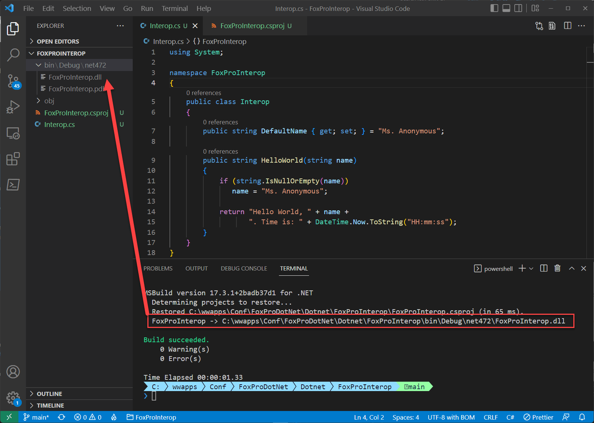

At this point you can actually access this assembly from FoxPro with:

```foxpro
*** Load library
do wwDotNetBridge

loBridge = GetwwDotnetBridge()
? loBridge.LoadAssembly("..\Dotnet\FoxProInterop\bin\Debug\net472\FoxProInterop.dll")

loInterop = loBridge.CreateInstance("FoxProInterop.Interop")
loInterop.DefaultName = "Jane Anonymous"
? loInterop.HelloWorld(null)
? loInterop.HelloWorld("Frederik")
```

Here's what that looks like when you run it in FoxPro:

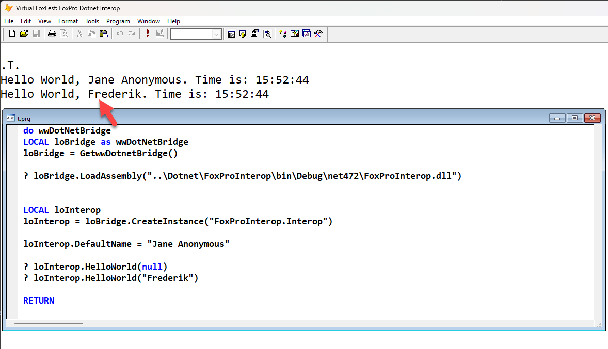

Yay! It works!

### Fixing up the Project File and Build Process
So this works fine, but we'll want to change a couple of things to make it easier to work with the code:

* **Put the Assembly into our FoxPro project location**  
The DLL path is buried in the build output directory and while that works it's unwieldy. We don't want to copy the file each time we've built, so instead we should build into our FoxPro project folder - or a `/bin` folder below it (if you have a bunch of external DLLs).

* **Create a Release Build**
If you look closely at the output path you'll see that it includes the build target and build 'mode' which in this case is `Debug`. For final DLL we'll want to build a `Release` build.

#### Fixing the Output Path
The first thing I want to change is the build output path so that the compiled DLL gets built into a folder that's accessible for my host FoxPro project. 

To do this we can add a couple of keys - `<OutputPath>` and `<AppendTargetFrameworkToOutputPath>` - to dump the file where we want it:

```xml
<Project Sdk="Microsoft.NET.Sdk">

  <PropertyGroup>
	  <Version>1.0.1</Version>
	  <TargetFramework>net472</TargetFramework>
	  
	  <!-- THESE TWO SETTINGS CONTROL THE OUTPUT PATH -->
	  <OutputPath>..\..\..\FoxPro\bin</OutputPath>
      <AppendTargetFrameworkToOutputPath>false</AppendTargetFrameworkToOutputPath>
  </PropertyGroup>

</Project>
```

Preferably use a **relative path** for the `OutputPath`, so the location is portable if you move your project. In this case I point back to my FoxPro project which sits as a peer to the .NET project a few folders back in the folder hierarchy. Use any full path or a path that is relative to the project folder.

Personally, I like to stick .NET assemblies into a separate `\bin` folder below my FoxPro project root, mainly because .NET Projects often have additional dependencies. By using the `\bin` folder and adding that path from the application, it keeps the clutter in the root folder to a minimum.

Once these changes have been made you can now rebuild your project with:

```ps
dotnet build
```

and it'll produce the output in the specified `bin` folder.

#### Creating a Release Build
By default .NET builds a **Debug** build. Debug builds include debug information and don't compile some optimizations. Typically you'll use a Debug build when working on a project, and a **Release** build when you build a final build. 

For use in FoxPro you'll always want to build a Release build **unless you are explicitlly debugging the code with a Debugger** (more on this later).

To create a Release build we can use the `-c Release` command line switch:

```ps
dotnet build -c Release
```

#### Can't Compile: Locked DLLs
If you compiled and ran the project, then made a change and tried to recompile, you probably found that you can't, because the DLLs are loaded by your FoxPro application:

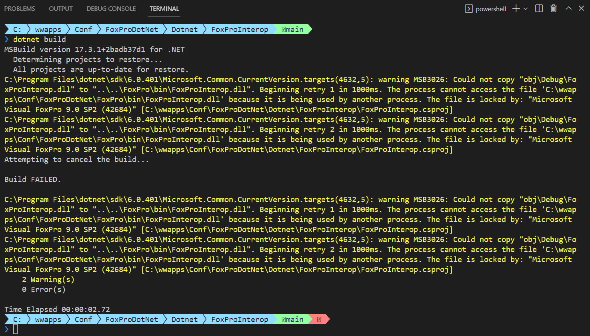

Once loaded into a host process - your FoxPro application -  the .NET assemblies become locked in memory and **can't be unloaded unless FoxPro (or your standalone application) is shut down**.

In order to rebuild the project, you'll have to quit FoxPro or your application, then build the .NET project, then restart your FoxPro application.

> There's cheat for this behavior, if you use the latest version of Visual Studio, which has support for Hot Reload. This feature allows you to make many changes in .NET code **and continue running the host process**, while code is replaced in the running application. Surprisingly Hot Reload works even when running a .NET component from Visual FoxPro in the Visual Studio Debugger. More on this later.

#### Compilation Errors
While we're at let's also talk about compilation errors. Before you can run an application or create output for component you have to have an error free compilation.

.NET is a compiled language so it checks for syntax errors, type mis-assignments, missing values for parameters etc., all **at compile time**. You'll find that compile time error checking easily catches 90% of errors that you're likely to make when writing code.

When your code does have errors you can see the compiler output as part of the `dotnet build` command. Here's what this looks like in the terminal in VSCode:


It gives you an explanation and a line/col number for the code which you can use to catch the error.

The editor also does real-time background compilation of the code you're editing and shows you errors as you are writing your code in the editor, highlighting errors with red squiggles hover pop overs for more information about the error:

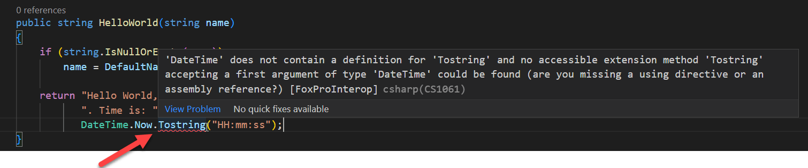

This feature comes courtesy of the Omnisharp C# language server, which is a generic component that is used by several editors to provide C# language support. Bigger IDEs like Visual Studio and Rider use different engines that are more sophisticated, but the OmniSharp integration in VS Code is pretty useful and provides many features like error display, basic code navigation and some basic refactorings which is great if you want to stick to a light weight editor solution like VS Code.

### Adding more Functionality
Alright back to our code. Assuming you've fixed your code lets add some more functionality.

#### Adding Simple Methods
Let's add a couple of more methods to the `Interop` class that perform some simple math. 

```cs
public decimal Add(decimal number1, decimal number2)
{
    return number1 + number2;
}

public long Multiply(int number1, int number2)
{
    return (long)number1 * number2;
}
```        

Then let's build the project again from the command line making sure we shut down FoxPro first.

```ps
dotnet build -c Release
```

Then restart FoxPro and add calls to these two methods to our sample program:

```cs
LOCAL loInterop
loInterop = loBridge.CreateInstance("FoxProInterop.Interop")

loInterop.DefaultName = "Jane Anonymous"
? loInterop.HelloWorld(null)
? loInterop.HelloWorld("Frederik")

? loInterop.Add(10, 20)
? loInterop.Multiply(20, 10)
```

Running this code you'll find that:

* The `Add()` method works as expected
* The `Multiply()` method fails

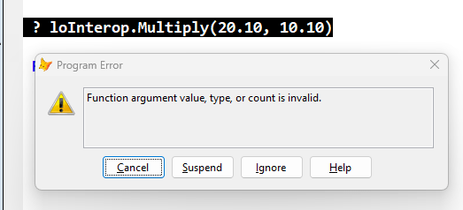

So why does the second method fail, while the first one works? The error **Function argument value, type or count is invalid** points to a problem with either a parameter that is being passed to the method or a result value that is passed back. In this case it's the latter because `long` is not supported by COM. COM can't marshal the value so the method call fails.

As a general rule: If a method call fails with one of these two errors:

* **Function argument value, type or count is invalid**  
This usually means the result type can't be passed back to FoxPro via COM.

* **No such Interface supported**  
This means that .NET couldn't find a method or property that matches the signature of the function. This is often caused by passing parameter types that don't match or calling a method that can't be converted.

try using `InvokeMethod()`, `GetProperty()` or `SetProperty()` to indirectly access the method and pass parameters.

You can fix this by using **wwDotnetBridge** to **indirectly call the method** by proxying the call through .NET.

```foxpro
* ? loInterop.Multiply(20.10, 10.10)
lnResult = loBridge.InvokeMethod(loInterop, "Multiply", 20, 10)
? lnResult     && 200
```

and voila that now works.

#### Passing Complex Objects between .NET and FoxPro
Next let's add a couple of classes to demonstrate passing complex object back and forth. Let's start with two more methods for the `Interop` class that get a `Person` object, and allow passing one to .NET:

```csharp
public Person GetPerson()
{
    var person = new Person();
    return person;
}

public bool SetPerson(Person person)
{
    DefaultPerson = person;
    return true;
}
```

Then we can add two classes like this - either at the bottom of the `Interop.cs` file or in a separate `Person.cs` file. I'll use the latter:

```csharp
using System.Collections.Generic;

namespace FoxProInterop
{
    public class Person
    {
        public Person()
        {
            var addr = new Address();
            Addresses.Add(addr);

            addr = new Address()
            {
                Street = "111 Somewhere Lane",
                City = "Doomsville",
                PostalCode = "22222",
                Type = AddressTypes.Shipping
            };
            Addresses.Add(addr);
        }

        public string Name { get; set; } = "Rick Strahl";
        public string Company { get; set; } = "West Wind";
        public string Email { get; set; } = "rickstrahl@bogus.com";
        public List<Address> Addresses { get; set; } = new List<Address>();
    }

    public class Address
    {
        public static int IdCounter = 0;

        public int Id = ++IdCounter;
        
        public string Street { get; set; } = "101 Nowhere Lane";
        public string City { get; set; } = "Paia";
        public string PostalCode { get; set; } = "11111";

        public AddressTypes Type { get; set; } = AddressTypes.Billing;
    }

    public enum AddressTypes
    {
        Billing,
        Shipping
    }
}
```
This creates a  `Person` class that has some simple properties and a collection of child addresses. The constructor for the class creates a couple of default addresses and adds them to the list. The address type additionally has an `enum` to identify an address type - either a billing or shipping address.

This class is used as output to the `GetPerson()` and as input to the `SetPerson()` methods of the `Interop` class. The purpose is to demonstrate how you can pass and access the functionality of nested classes in FoxPro to give you a feel of the structures that you can create in C# and easily access from FoxPro. 

Again build the project from the Terminal:

```ps
dotnet build -c Release
```

##### Retrieving an Object from .NET
Now let's use these two methods from FoxPro.

First lets retrieve a Person object and use the object in FoxPro:

```foxpro
loBridge = GetwwDotnetBridge()

? loBridge.LoadAssembly("FoxProInterop.dll")
loDotnet = loBridge.CreateInstance("FoxProInterop.Interop")

*** Call the method directly via COM
loPerson = loDotnet.GetPerson()

*** Simple properties direct access
? loPerson.Name
? loPerson.Company

*** 2. Retrieve using a ComArray Wrapper object
loAddresses = loBridge.GetProperty(loPerson, "Addresses")

FOR lnX = 0 TO loAddresses.Count-1
    *** 1. Retrieve an item by its index 
    loAddress = loAddresses.Item(lnX)

    *** 2. Alternate access syntax using GetProperty and Index syntax
    * loAddress = loBridge.GetProperty(loPerson,"Addresses[0]")

    *** Simple Properties can use direct access
    ? loAddress.Id
    ? loAddress.Street
    ? loAddress.City
    ? loAddress.PostalCode
    
    *** enum - shows as an integer
	? loAddress.Type
ENDFOR
```

The comments describe what's happening in this code and you can see once again that some features just work using direct COM access, and others - namely the `Addresses` collection access requires special handling using the `wwDotnetBridge` Proxy functions to gain access to the data.

##### Passing an Object To .NET + Generics
Now let's call the `SetPerson(person)` method that passes a Person object from FoxPro to .NET. There are couple of things you need to know for this to work:

* **Any .NET Object you pass to .NET **has to be created in .NET****  
This means you cannot create an object to pass to .NET in FoxPro code **even if it has the same property names as a type you are passing**. Types have a unique signature in .NET and it has to be **the exact same type** that is specified which means you have to create the type **in .NET**.  The only way a FoxPro object can be passed to .NET is as a **non-typed object** either as type `object` (which requires Reflection) or `dynamic` which allows dynamic member access similar to the way FoxPro allows COM objects to be accessed.

* **Generic Lists/IEnumerables (ie. `List<Person>`) can be tricky**  
The `Person` class has a `List<Person>` property and these types are not directly COM accessible. They also don't work for writing via `ComArray` so special syntax is needed to access generic lists and collections using `InvokeMethod()` to manipulate the collections.

The following code addresses both these scenarios.

```foxpro
loBridge = GetwwDotnetBridge()

? loBridge.LoadAssembly("FoxProInterop.dll")
loDotnet = loBridge.CreateInstance("FoxProInterop.Interop")

*** Important: In order to pass an object that object
***            must be created in .NET!

*** Create a new .NET Person object and set in FoxPro
loPerson = loBridge.CreateInstance("FoxProInterop.Person")

*** Simple assignments
loPerson.Name = "Rick Strahl New"
loPerson.Company = "Easter Egg"
loPerson.Email = "test@easteregg.com"

*** Create a new Address instance
loAddress = loBridge.CreateInstance("FoxProInterop.Address")
loAddress.Street = "321 Somewhere Lane"
loAddress.City = "Somewhere"
loAddress.PostalCode = "44444"

*** Access the generic type (ComArray) - this doesn't work for updates!
* loAddresses = loBridge.GetProperty(loPerson,"Addresses")

*** Use indirect syntax - required because .NET Generic (List<Address>)
loBridge.InvokeMethod(loPerson, "Addresses.Clear")            && clear existing
loBridge.InvokeMethod(loPerson, "Addresses.Add", loAddress)   && add our item


*** Access the list get back a ComArray
loAddresses = loBridge.GetProperty(loPerson,"Addresses")

*** Now push that to .NET
? loDotnet.SetPerson(loPerson)


? "*** DefaultPerson from .NET"

*** Grab the .NET Updated Person instance and echo
loPerson2 = loDotnet.DefaultPerson

? loPerson2.Name
? loPerson2.Company
? loPerson2.Email

loAddresses = loBridge.GetProperty(loPerson2,"Addresses")

FOR lnX = 0 TO loAddresses.Count -1
	loAddress = loAddresses.Item(lnX)

	? loAddress.Id
	? loAddress.Street
	? loAddress.City
	? loAddress.PostalCode

	*** Enum - shows as an integer
	? loAddress.Type 
ENDFOR
```

To reiterate the key point that .NET properties and instances have to be created in .NET, this applies to both the top level `Person` as well as the nested list Address item:

```foxpro
loPerson = loBridge.CreateInstance("FoxProInterop.Person")
...

loAddress = loBridge.CreateInstance("FoxProInterop.Address")
...
```

For the Address item, the `List<Address>` addresses have to be manipulated using explicit object hierarchy syntax to `Clear()` the collection (because the constructor creates a couple of default items) and then calling `Add(loAddress)` to add the item to the collection:

```foxpro
loBridge.InvokeMethod(loPerson, "Addresses.Clear")            && clear existing
loBridge.InvokeMethod(loPerson, "Addresses.Add", loAddress)   && add our item
```

All of this works and gives you an idea how you can deal with Complex objects.


#### Adding a Third Party Library from a NuGet Package
NuGet is a component package manager that allows you to easily add third party libraries to your application. A **NuGet Package** is a Web stored package that contains the required binary files for a given library and the package may itself reference other NuGet packages as a dependency. The end result is that it's a way to quickly add third party libraries to your projects with a single command.

For this next example, I'll add a Markdown Parsing library called `MarkDig` to our project and we'll use it to create a quick and dirty Markdown parser that you can call from FoxPro.

Let's use NuGet with the `dotnet add package` command. From the project root folder, run the following command from the terminal:

```ps
dotnet add package MarkDig
```

Here's what that looks like:

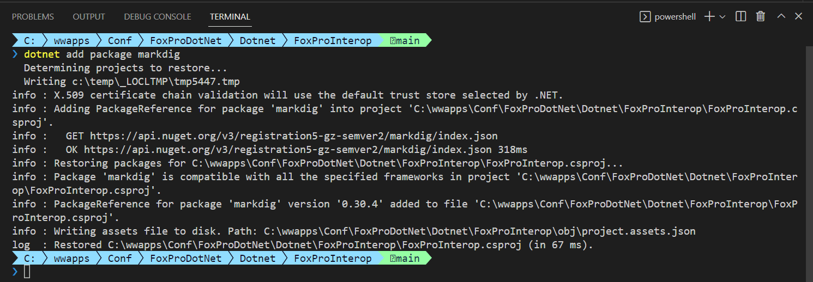

This adds the package to the project and you can now use any of MarkDigs features. You can see the reference to the package added to the Project:

```xml
<Project Sdk="Microsoft.NET.Sdk">

  <PropertyGroup>
    <TargetFramework>NET472</TargetFramework>

  	<OutputPath>..\..\FoxPro\bin</OutputPath>
    <AppendTargetFrameworkToOutputPath>false</AppendTargetFrameworkToOutputPath>
  </PropertyGroup>

   
  <ItemGroup>
    <PackageReference Include="markdig" Version="0.30.4" />
  </ItemGroup>

</Project>
```

#### Creating Static Methods
To demonstrate Markdig let's use another useful example by creating a static method to do the Markdown conversion.

Static methods are 'instance-less' methods which means they can be invoked without first instantiating a class or an object reference. Instead the method is invoked *on a type*. And so we can add a static method to the `Interop` class we've already used.

To do this add a static method  this to the existing `Interop` class: 

```cs
public static string ToHtml(string markdownText)
{   
    var builder = new MarkdownPipelineBuilder();
    var pipeline = builder.Build();
    return Markdig.Markdown.ToHtml(markdownText, pipeline, null);
}
```

To call this from FoxPro looks like this:

```foxpro
loBridge = GetwwDotnetBridge()

? loBridge.LoadAssembly("FoxProInterop.dll")

TEXT TO lcMarkdown NOSHOW
# Markdown Parsing with wwDotnetBridge


Render Markdown into HTML for embedding into document centric applications 
that can display content as HTML. 

This sample uses **Markdown Text** that is parsed using the 
[Open Source .NET MarkDig Library](https://github.com/xoofx/markdig),
accessed using a small bit of [wwDotnetBridge](https://github.com/RickStrahl/wwDotnetBridge) code.


* Full featured Markdown Parser
* Support for many optional Markdown Flavors
* GitHub formatted Markdown
* and much more...

It's easy to use and quick to get started with.

> ####  Examples are great
> Markdown is a popular format used for many types of documentation, 
> message boards, social media sites and many popular editors

*&copy; West Wind Technologies*
ENDTEXT

*** Call a static method: Provide a type name, method name and parameters
lcHtml = loBridge.InvokeStaticMethod("FoxProInterop.Interop", "MarkdownToHtml", lcMarkdown)
? lcHtml
ShowHtml(lcHtml)
```

This produces HTML output like this:

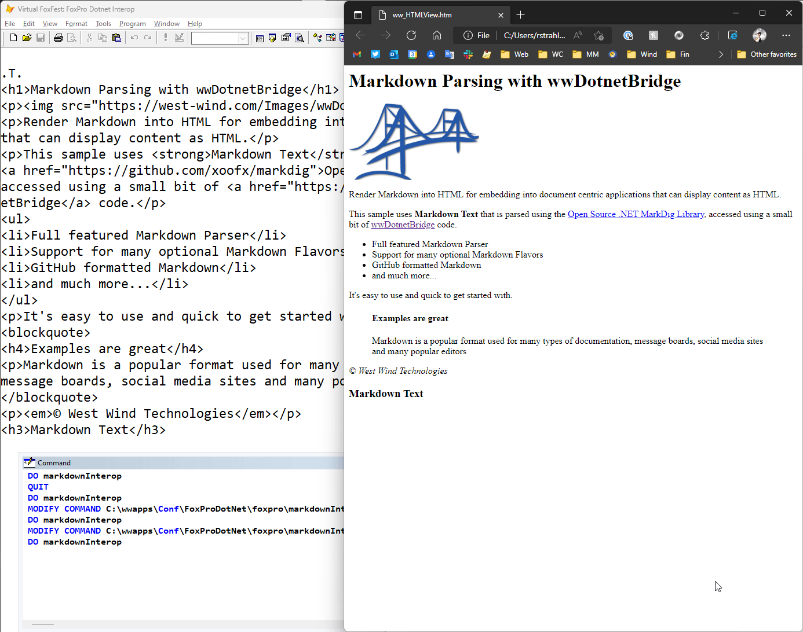

This works fine and as you can see you can make short work of using the static method in an existing class. In fact, this is a good approach for utility libraries that bunch together a bunch of useful commands.

However a slightly better approach is to move static methods into more logical units. If you have multiple operations that can be grouped together, or if you have a static method that might need additional setup and configuration that stores other static content, it's often a good idea to give even a single static method its own dedicated class.

Let's refactor the .NET code into its own class like this:

```csharp
using Markdig;

namespace FoxProInterop
{
    public class Markdown
    {
        private static MarkdownPipeline pipeline { get; set; }

        static Markdown()
        {
            var builder = new MarkdownPipelineBuilder()
            .UseAdvancedExtensions()
            .UseDiagrams()
            .UseGenericAttributes();
        
            pipeline = builder.Build();
        }

        public static string ToHtml(string markdownText)
        {   
            return Markdig.Markdown.ToHtml(markdownText, pipeline, null);
        }
    }
}
```

To call this from FoxPro is pretty much identical than before just with a different static type signature:

```foxpro
lcHtml = loBridge.InvokeStaticMethod("FoxProInterop.Markdown", "ToHtml", lcMarkdown)
```

Alright, I think you get the idea - static methods are one of the simplest way to expose functionality in .NET and call it from FoxPro as you don't need to instantiate a type first and you can pass one or more parameters into these methods.

> Just as an aside when creating methods in .NET: Don't create methods with huge parameter lists because that gets unwieldy when calling from FoxPro especially if you need to use `InvokeMethod()`. Rather opt for creating **parameter objects** that are specifically designed to have properties for the settings required for the method to run. This makes it easier to set many values in a more predictable way and also allows for creating default values.

Although all of these examples are very simple, they give you a pretty good idea of quite a few of the things that you can quite easily do with .NET **with very little effort**. Calling this code from FoxPro can be very easy to do.

## Writing Code: IntelliSense, Errors,  Debugging and Type Discovery

### IntelliSense
One of the nice features of .NET is that it has rich type inference support, meaning that it can provide deep insight into classes, interfaces, methods and properties as you are writing your code, providing rich IntelliSense.

This is one of the main reasons why you want to use .NET rather than FoxPro code to write even slightly complex code, because it's much easier to figure out what is available then trying to guess in FoxPro code, or even use a type discovery tool that is static. The fact that you can simply start writing code and use IntelliSense to figure out what's available is very powerful.

Full featured IDEs like Visual Studio and Rider had this functionality forever, but now with the generic Omnisharp Language service that can and has been plugged into many editors you can now also get this functionality in a simpler editor like VS Code.


### Compilation Error Display 
We briefly touched on error display earlier: .NET is a compiled language system, which means code has to be compiled and checked for validity before it can be run. Compilation is pretty painless these days even if you use low level tools and the command line as you can just use:

```cs
dotnet build -c Release
```

to compile your .NET component. If there are errors the compiler displays the errors in red in the compiler output of the command:


From there you can find the line number of the error and start fixing your code. 

The compiler also runs in the background in VS Code, Visual Studio, Rider and other tools and shows you errors right as you type and highlights errors with Red Squiggles:


You can hover over the error and see more information.

Error detection at compile time is very useful as it makes sure at minimum that your code is semantically correct. It also helps if you are making changes to code, or are refactoring in ensuring that code that may be indirectly affected and breaks, breaks at compile time rather than at runtime.

### Editor Refactoring, Code Hints and More for Code Discovery
The rest of the topics in this section deal with Code discovery in some form

Even VS Code which is about as low level as you can get for C# language support, features a number of editor tools to help with common tasks. It provides code hints for possible code improvements, suggestions for incomplete code, and options to Refactor code for you for many things. VS Code's support for these things is fairly minimal, and if you use a full IDE like Visual Studio or Rider you get many more built-in Refactorings and Code hints that help with code. But again, for minimal code support even these base features are pretty nice in VS Code.


This useful hint lets you turn a C# string + expression value into a single interpolated string (`$". Time is: {name}"` instead of `"Time is: " + name`) which is a common refactoring.

The context menu also has a number of options and shortcut keys:

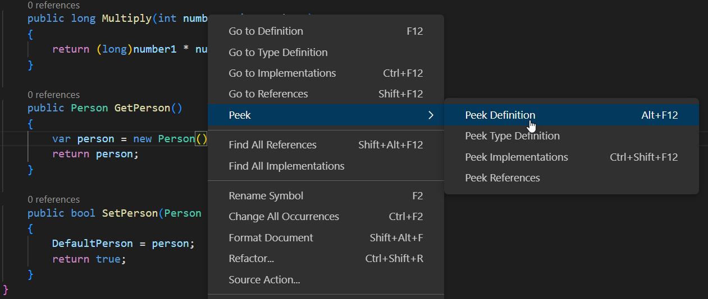

One particular useful one is the **Go to Definition** (`F12`) code navigation that lets you jump to the defining method, class or property to see how the code works. Also there's **Peek Definition** (`Alt-F12`) which is similar but displays the Definition code inline in read only mode:

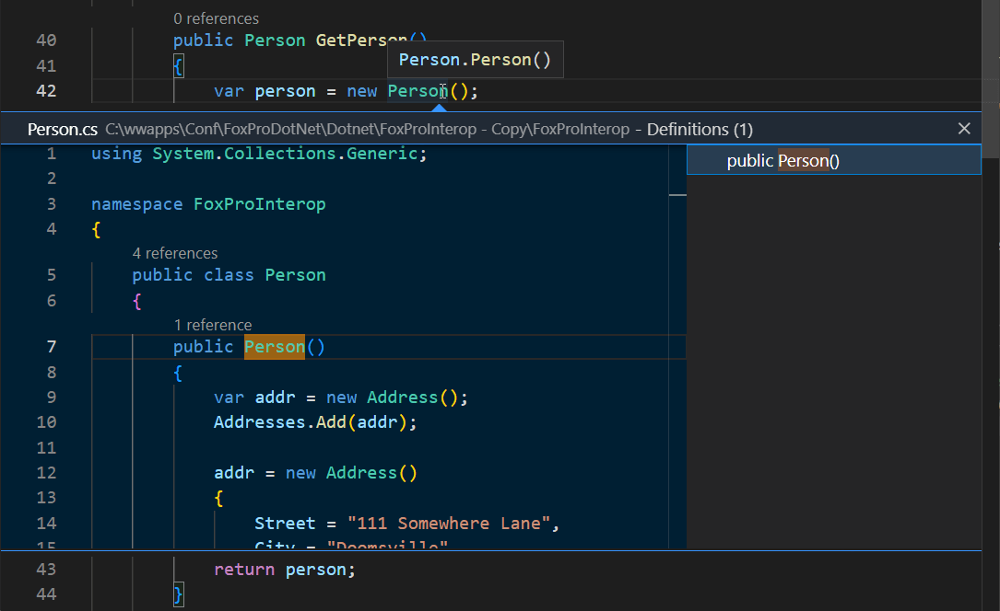

## Visual Studio
So far we've stuck with the simple VS Code editor which is a fast and flexible code editor. It works pretty well for what we've been doing so far and if all you are doing is to build a small component with a few methods to be called from FoxPro VS Code is probably all you need.

However, if you are planning on writing a lot of .NET code, and doing a lot of debugging, I think you will find it useful to use a full IDE like Visual Studio or Rider, even if it means installing behemoth of an application.
  
Visual Studio Community Edition is free and includes all of the features that you need.

* [Visual Studio Community Edition](https://visualstudio.microsoft.com/vs/community/)

Debugging of .NET code in particular is something **that is not easily done without an IDE like Visual Studio or Rider**. But Visual Studio and Rider also provide many more helpful code tools for Refactorings, Code Completions, IntelliCode (AI code completion which is surprisingly good!), enhanced code navigation, advanced tool windows to track and rearrange class code, show associations and much more. For serious developers that do a lot of .NET work, it's well worth to use a full IDE.

As to Visual Studio it's not quite the behemoth it used to be. These days it has a Web based installer that's somewhat streamlined and lets you pick just the workloads that you want to install instead of the entire kitchen sink:

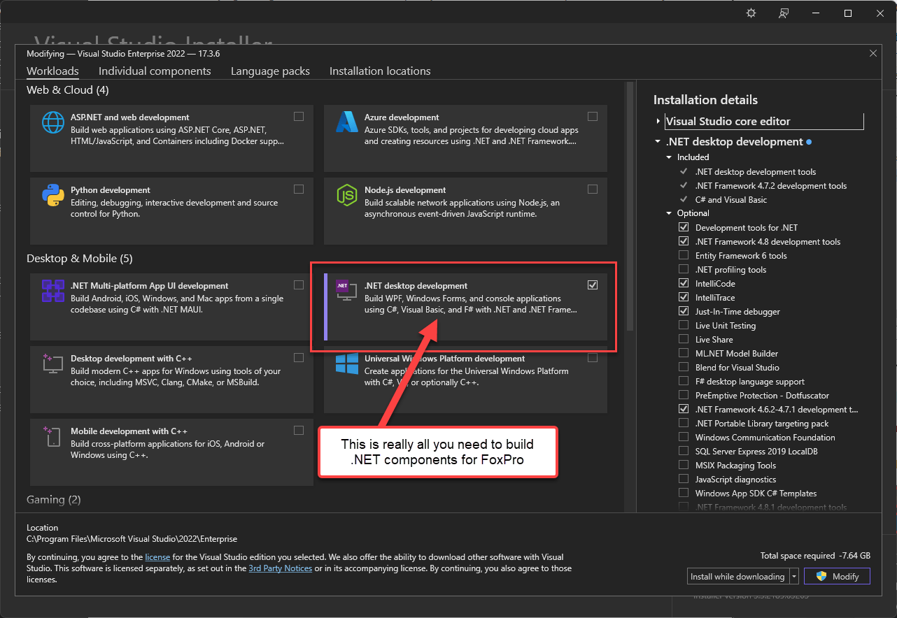

Once you've installed Visual Studio and installed the .NET workload, you can open the existing projects we've created there and take advantage of the additional features of the IDE.

I'll use Visual Studio for the following discussion. 

### Opening a Project in Visual Studio
So lets do this. We'll start by opening our project in Visual Studio.

* In Explorer find the `.csproj` file
* Right click and Use  Open With... and Visual Studio

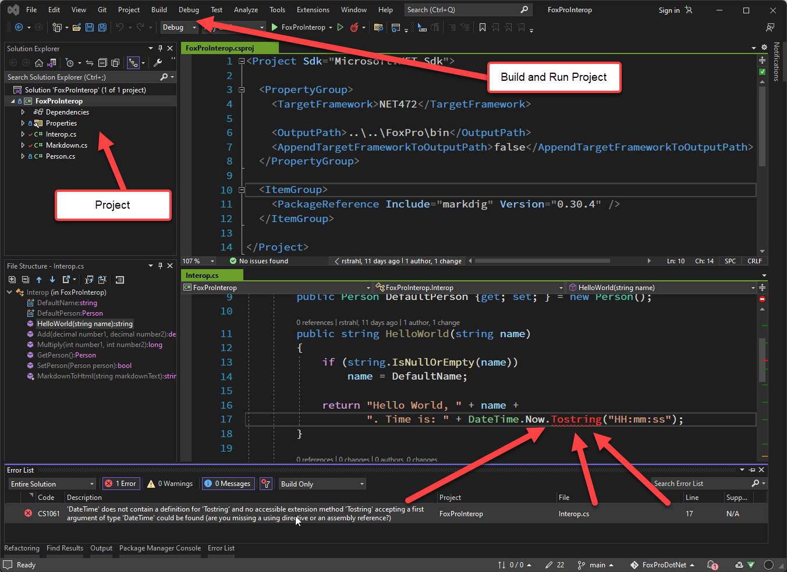


> #### Visual Studio Solutions
> Note that Visual Studio works with a **Solution** which is top level container for one or more projects. So a `.sln` file can references multiple `.csproj` (or other) Projects. Once you've opened the project, Visual Studio wants to save a Solution file (ie. `FoxInterop.sln`) so do that when asked. You can name it the same as your main project and store at the project root. Typically you'll launch your project via the Solution file.
>
> Solutions tie together multiple projects that go together, for example a component and a related Test project, or a Web application, its business object library and test projects.

Once the project is loaded, you can **Build** the project in Visual Studio using the Build menu, context shortcut, or the default `Ctrl-Shift-B` command which builds all projects in the Solution. This builds the project and shows the build result  on the status bar, or - if errors occur as shown -  shows an error list in the **Errors Tool Window** on the bottom. If you have errors you can click the, and VS navigates to the offending line in the code.

Most of this is simply a nicer user interface - you can do these tasks in VS Code as well, but here the UI lets you click a button or use a hotkey, rather than using an explicit command line command - which BTW you can still do even if you are using Visual Studio.

### Debugging your .NET Project from FoxPro
So far, so convenient; UI features are nice, but not essential. 

But the **key feature of Visual Studio for FoxPro .NET Interop is debugging** because there's really no other easy way to do runtime debugging of .NET components. 

You may be able to get away without debugging for your .NET components, by just using error handling and error properties to communicate error information, and that might be enough.
  
But if you want to do runtime Debugging, set breakpoints, step through .NET code and examine live objects and variable and so on, then Visual Studio is the only reasonable choice.

So lets debug our .NET Component doing the following:

* Set up debugging in Visual Studio 
* Start the project by running Visual FoxPro with the Debugger
* Starting at the FoxPro command window
* Run the FoxPro code that calls into .NET via Interop
* Set a breakpoint in the .NET code
* Step through
* Return back to FoxPro

The first step is to configure our project. There are two ways to do this:

* Debug Configuration Settings
* `launchprofiles.json`

The former sets the latter so this is essentially a different path to the same endpoint. 

#### Setting up Debugging
To set up debugging with the UI tool:

* Go to the Project node in Solution Explorer
* Right click and select **Properties**
* Select the Debug tab
* Click on Open Debug Launch Profile UI

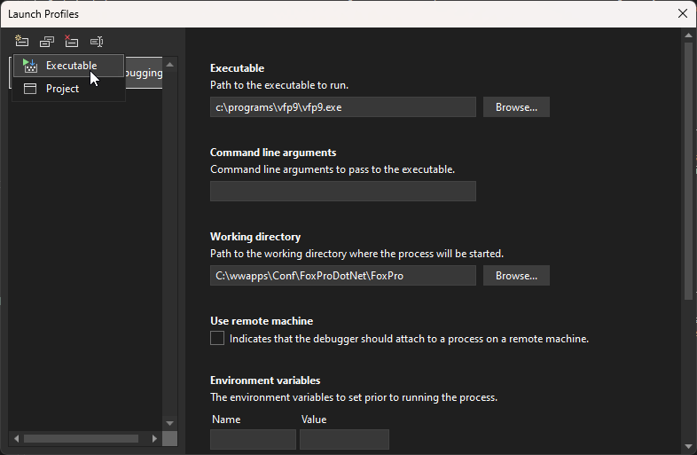

* Click the first icon and select **Executable** (important)
* This creates a new profile
* Set the Executable and point at `vfp9.exe`
* Set the Working Directory and point at your FoxPro app folder
* Folder should be from where to run your test prg/app
* Remove the old profile and rename yours
* Here I rename to `FoxProInterop Debugging` as Profile Name

This ends up producing a `\Properties\launchprofile.json` in the project that looks like this:

```json
{
  "profiles": {
    "FoxProInterop Debugging": {
      "commandName": "Executable",
      "executablePath": "c:\\programs\\vfp9\\vfp9.exe",
      "workingDirectory": "C:\\wwapps\\Conf\\FoxProDotNet\\FoxPro"
    }
  }
}
```

> Personally I just edit the launchprofile manually which is quicker than the user interface. The key feature here is `commandName: "Executable"` - the default is `Project` which tries to run the compiled assembly which doesn't work here since we create a library rather than a startable application.

To start debugging now:

* Make sure the project is the  **Startup Project** (if more than 1)
* Set a breakpoint in the `Interop.HelloWorld()` method
* Click the `Play` button in the toolbar (or press `F5`) to start debugging
* FoxPro pops up at the Command Window
* Run your test program: `DO Interop.prg`


You can now step through your code, inspect local variables, any explicit watches you've set up, make changes to values, jump through the call stack etc. You can also use the **Intermediate Window** to evaluate any expression - calling methods or get property values etc.

The execution point can be moved around in many scenarios by simply dragging it to a new location. This doesn't work for everything - some scenarios that code couldn't naturally reach are not allowed but you can easily re-run code that you to examine again to understand what happened (yeah I do this a lot! :smile:).

#### Hot Reload in the Debugger
A very new feature in Visual Studio 2022 is the ability to make code changes in **running code** and apply those changes, without restarting the entire application. Again this feature doesn't work for everything - some changes that change the signature of called functions or members can't be recompiled in place - but a lot of small changes can actually be made without recompiling the code. This means you can start the debugger and almost interactively build your code in .NET while you simply re-run your code.

This is especially useful for COM Interop because remember that .NET assemblies once loaded lock the DLL they're housed in, and cannot be unloaded directly - this saves you the many steps of stopping the FoxPro app, going back into Visual Studio, compiling and then re-running the application and starting it back up.

For a simple example of this run the `HelloWorld.prg` to load the application. Then go into Visual Studio and change the following from:

```csharp
return "Hello World, " + name +
       ". Time is: " + DateTime.Now.ToString("HH:mm:ss");
```

Run the application with that and you get a date like `17:19:22`.
  
Then change the above to a different date format:

```csharp
return "Hello World, " + name +
       ". Time is: " + DateTime.Now.ToString("MMM  dd, yyyy hh:mm tt");
```

And you get `Oct 14, 2022 05:22 pm`.

Neat! This can be a big time saver especially for COM Interop components.

Just keep in mind that some changes won't allow for this to work and the editor will warn you:

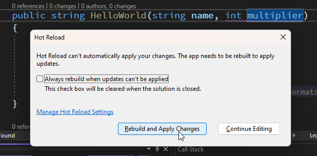

In this case I added a parameter to a method which changes signature and that breaks hot reload. 

Even with these limitations this feature is incredibly useful and can help cut down on the time it takes to figure out how to get code running as you can rapidly iterate the .NET code.

## Discovering .NET Functionality
One of the things you'll find yourself doing a lot of when you're using .NET is trying to discover functionality of components. There are thousands of components available but quite a lot of them are not extensively documented so code discovery is very important. 

There are many tools both native and external that can help with finding out what functionality is available and ways to test and experiment with code quickly in .NET.

### IntelliSense
The most obvious tool is IntelliSense which you end up using no matter what tool you use to edit .NET code short of Notepad. Any editor that has basic C# support likely has some support for IntelliSense that provides deep type discovery as you access functionality.

IntelliSense triggers on typing a `.` in the editor, both in VS Code and Visual Studio. Additionaly code hints and behaviors are accessible via `alt-.`.

Here's plain IntelliSense in VS Code:

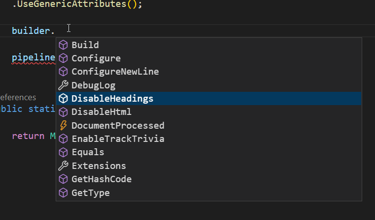

And then again once you select a property or method which in this case shows the method signature, plus the documentation:

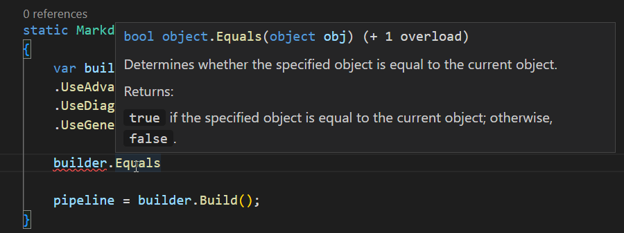

IntelliSense is a great tool to discover immediate class member discovery as long as you can figure out the base functionality of a component.

One trick to discover additional types is to start typing the top level namespace and start drilling inwards to discover top level classes and nested feature namespaces:

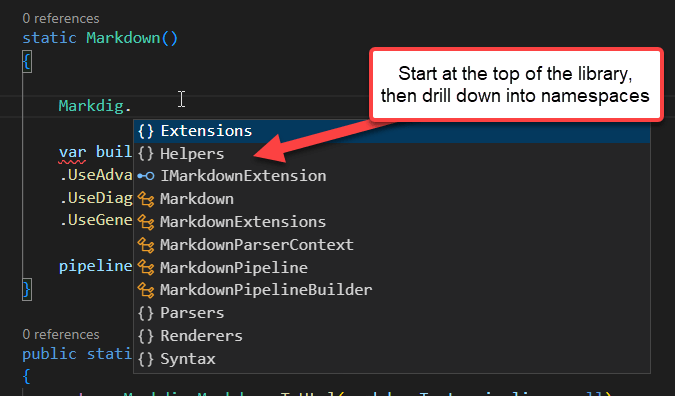

### Using a Decompiler Tool
IntelliSense works as long as you have some idea what you're looking form. If you have no documentation or you just need to see the entire library from a high level to discover base types, you can use a Decompiler tool that allows you to deconstruct libraries by showing you all .NET types and their members.

There are a number of tools that can help you with this:

* Reflector  (free for pre-v6, commercial after)
* DotPeek (JetBrains - free)
* JustDecompile (Telerik - free)
* IL Spy (open source)

I've included a copy of pre-v6 Reflector that you can play around with in the samples' `\Tools\ReflectorV6` folder.

To give you an idea, here is our sample `FoxProInterop.dll` displayed in Reflector:

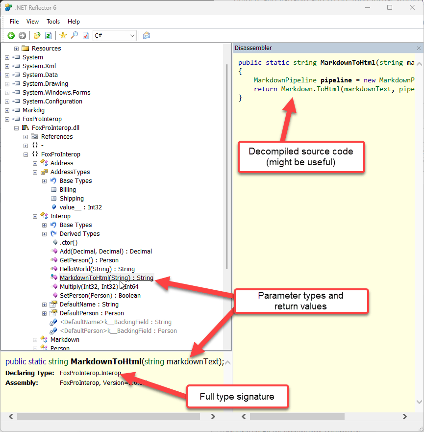

You can see that Reflector shows all the namespaces, classes and members and you can then drill into to inspect parameters and signatures for the types and methods. You can also quickly jump to related types that are assigned to properties or used as parameters or return values to methods.

Essentially these tools allow you to browse libraries. These libraries are also **decompilers** and can for the most part show you to source code for classes or individual methods. .NET code compiles into well-known byte code that can with some effort be decompiled back into its original source code. You'll lose things like internal variable names but the code structure can fairly reliably be retrieved this way. This can be useful either to figure out what code does, or in some case let you lift a small bit of code that you can reuse (assuming the license permits it).

I highly recommend getting one of these tools for FoxPro Interop in particular. If you're using wwDotnetBridge without creating .NET components this is especially useful since you won't get IntelliSense to help you in that scenario.

### LinqPad: A Command Window for .NET
A great way to experiment with .NET in a very small environment is by using a tool called [LinqPad](https://www.linqpad.net/). LinqPad is like a FoxPro Command Window, but for .NET. You can quickly create or paste a small snippet of .NET code and execute it. You can also load quickly load NuGet packages or libraries (like our .NET component) and create a small program that can execute and output data.

It's a great tool for quickly trying out ideas or even for creating standalone methods and testing them in a very interactive environment.

In LinqPad I like to work in **Progam** mode which is basically a class with the `Main()` function that is the entry point. You can use `Console.WriteLine()` or the `.Dump()` extension method to output values to the Results window. The `.Dump()` method outputs entire object structures so you can drill into the actual objects with live values which is a powerful discovery tool.

I like **Program** because it allows you add additional methods that you can call from Main (or whereever), which makes it possible to abstract code for reuse once you get it working. You can even create classes inside of this program and then use the classes in the code.

Here's a basic example that demonstrates using the library we created and testing it quickly:

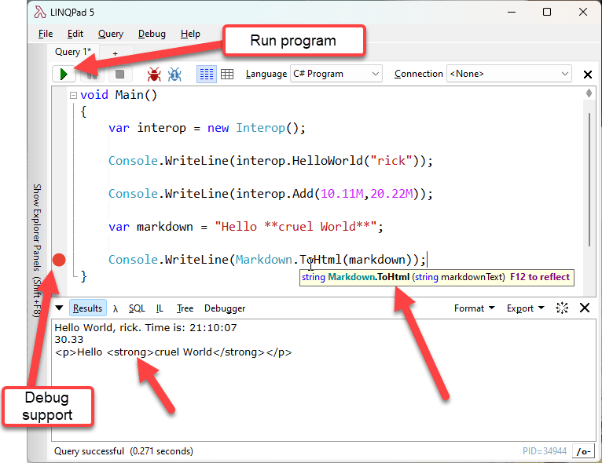

I added the `FoxProInterop.dll` reference from:

* Query Menu
* References and Namespaces
* You can also add NuGet Packages


With that in place I can now press F5 to run the code. I can set breakpoints to stop in the code and use the built in debugger to step through the code and examine objects contents etc.

LinqPad is a great tool for:

* Quickly checking for some C# Syntax feature
* Creating a small self contained program
* First testing .NET code you want to run with wwDotnetBridge
* Discover functionality via IntelliSense

I use LinqPad **all the time** to remember/check how .NET features behave with specific inputs, and frequently to build small utiility functions interactively.

> I highly recommend that whenever you plan on calling .NET code from FoxPro, to **first write the code out in .NET using LinqPad** or a Test Project.   
>  
>That way you can:
> 
> * Make sure the code works as expected in .NET
> * See how the code is supposed to work
> * Review and capture the type signatures for each method or property access
>  
> It's much better to run FoxPro against working .NET code, vs having to fight unpredictable behavior inside of .NET.

There are two versions of LinqPad:

* LinqPad 5 which uses Full .NET Framework
* LinqPad 7 which works with .NET Core

For FoxPro usage you probably want to use the older LinqPad 5 version. 

### Creating a Test Project
In a similar vein to using LinqPad, if you're building a more complex components in .NET code you might consider creating a separate .NET Test project.

Tests can serve a similar purpose as LinqPad in letting you quickly run single function code in a more interactive fashion. Test also serve as a functional project component to actually test behavior of your application and can ensure that your code works as expected. If tests cover a large portion of your code tests can help detect breaking changes caused by potentially unrelated code changes.

I'm not going to pontificate on use of tests here but rather point to them as a quick discovery tool that you can use to test your .NET easily outside of calling it from FoxPro.

To create a test project you can create another project either from the command line or Visual Studio. To create a test project with the Command line use:

```ps
dotnet new mstest -f net5.0 -n FoxProInterop.Test
cd FoxProInterop.Test
dotnet build
```

or you can use Visual Studio and add a **New Project .NET Core Test Project** to the Solution.

I use .NET 5.0 here to avoid the new C# 10 syntax used by the template. As for the main project you need to change the project's target framework. When it's all said and done you should have a project like this:

```xml
<Project Sdk="Microsoft.NET.Sdk">

  <PropertyGroup>
    <TargetFramework>net472</TargetFramework>
  </PropertyGroup>

  <ItemGroup>
    <PackageReference Include="Microsoft.NET.Test.Sdk" Version="17.1.0" />
    <PackageReference Include="MSTest.TestAdapter" Version="2.2.8" />
    <PackageReference Include="MSTest.TestFramework" Version="2.2.8" />
    <PackageReference Include="coverlet.collector" Version="3.1.2" />
  </ItemGroup>

</Project>
```

Next we'll need to add a reference to the `FoxProInterop` project.

In Visual Studio you can right click on the project and 

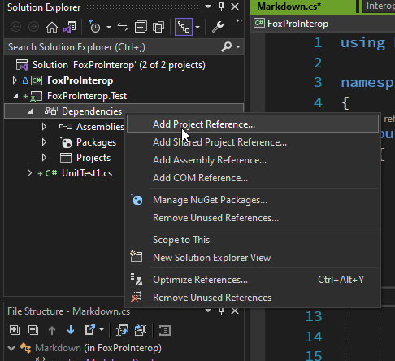

If you're doing this in code you can add this manually to the `FoxProInteropTests.csproj` project file:

```xml
<Project>
...
    <ItemGroup>
        <ProjectReference Include="..\FoxProInterop\FoxProInterop.csproj" />
    </ItemGroup>
</Project>
```

If we then create a test method that checks basic operation of the class:

```csharp
using Microsoft.VisualStudio.TestTools.UnitTesting;
using System;

namespace FoxProInterop.Test
{
    [TestClass]
    public class FoxProInteropTests
    {
        [TestMethod]
        public void HelloWorldTest()
        {
            var inst = new Interop();
            var result = inst.HelloWorld("risck");
            

            Assert.IsNotNull(result);
            Console.WriteLine(result);
            Assert.IsTrue(result.Contains("rick"), "Doesn't match name");
        }

    }
}
```

From VS Code and the Command line we can run it this way via `dotnet test`. Make sure you run it from the test project's folder:

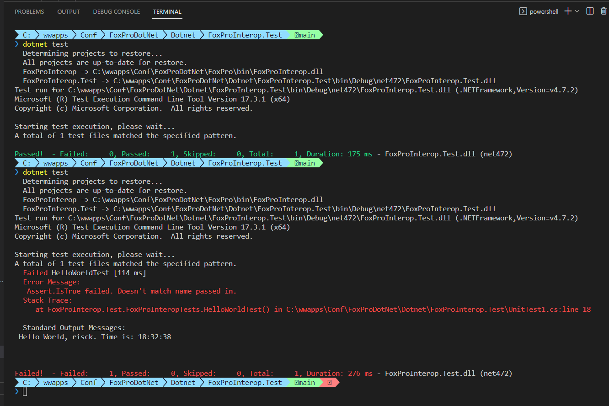

Note the first test passes with a valid value, the second fails with an invalid value. Test will pass if they run successfully and none of the `Assert()` calls fail. Test fail if the code doesn't compile, has a runtime error or any of the asserts fail.

From Visual Studio this is a little easier as you can use the Visual Studio test runner:


This is obviously much nicer, as you get a nice view of all of your tests and their previous execution status in a sticky window.

You can add many test methods to a single test class, and you can create multiple test classes and all of these tests can be run in batch or individually.

## Some Examples of Interop Libraries
Before I finish up here I want to show a few examples that I've exposed as .NET Libraries from FoxPro and in the process explain the rational of why. 

There are a number of different scenarios for .NET Integration:

* Single function integration
* Support library or helper functions
* Exposing a .NET Library to FoxPro with a simpler interface
* An application general purpose library 

### Single Function Integration
This type of integration is kind of what we've talked about in all the examples so far. We have something that needs to be done in .NET that involves more than a few lines of .NET code and it's generally easier to do this inside of .NET than using `wwDotnetBridge` on its own so we create a library with one or a few self-contained functions.

The Markdig example was a good candidate for this scenario. If it's a simple operation that's a one off you probably want to create a `static` method that you can call with one or a few parameters:

To review:

```csharp
public class Markdown
{
    public static string ToHtml(string markdownText)
    {
        var builder = new MarkdownPipelineBuilder()
            .UseAdvancedExtensions()
            .UseDiagrams()
            .UseGenericAttributes();
        var pipeline = builder.Build();
        
        return Markdig.Markdown.ToHtml(markdownText, pipeline, null);
    }
}
```

Remember, it's best not to pass too many parameters - if you need to pass a lot of data opt to pass an object that is descriptive of the parameters you want to pass:

```cs
public class MarkdownParameters 
{
    public string MarkdownText {get; set; }
    
    public bool AdvancedExtensions {get; set;}
    public bool UseDiagrams {get; set; }
    public bool UseGenericAttributes {get; set; }
}
```

then the method can accept this parameter

```cs
public static string ToHtml(MarkdownParameters markdownParms)
{
    // use the bools to customize the pipeline
    if (markdownParms.AdvancedExtensions) 
    {
        ...    
    }
    ...
    
    var pipeline = builder.Build();
    return Markdig.Markdown.ToHtml(MarkdownParameters.MarkdownText,
                                   pipeline, null);
}
```

Using `static` method is not a requirement for this scenario. You can also use a class that can be instantiated and called. The point of this scenario is more about having a very focused single operation that abstracts code in .NET which is quite common.

### Helper of Utility Functions
A slightly more sophisticated scenario is that of a utility helper library where you bunch together a bunch of functionality into a class of related operations. 

An example of this is an encryption library I created some time ago called [wwEncryption](https://client-tools.west-wind.com/docs/_4c10w1prc.htm). Basically this class provides two-way encryption, hashing and a few related functions like CRC calculation and binary encoding features that can be integrated into an application. It uses the .NET built-in encryption classes to provide an easy to use wrapper around the somewhat complex code in .NET.

The idea is to:

* Simplify the .NET Encryption logic into easy to call static methods
* Create a FoxPro `wwEncryption` Wrapper class that can call these methods

I've included the [C# class](https://github.com/RickStrahl/VirtualFoxFest2022-FoxProDotnet/blob/main/Dotnet/wwEncryption/wwEncryption/EncryptionUtils.cs) and [FoxPro class](https://github.com/RickStrahl/VirtualFoxFest2022-FoxProDotnet/blob/main/Dotnet/wwEncryption/wwEncryption.prg) in the examples and it's also part of the commercial version of `wwDotnetBridge` in the West Wind Client Tools. 

I don't want to rehash all the code, but show one piece of it for encyrption to demonstrate why this is a .NET component vs calling the code directly from FoxPro. In short it's a bit of code and it's not code that would 'just work' over COM from FoxPro.

<small>*truncated: [full code](https://github.com/RickStrahl/VirtualFoxFest2022-FoxProDotnet/blob/main/Dotnet/wwEncryption/wwEncryption/EncryptionUtils.cs)*</small>

```csharp
public static class EncryptionUtils
{
    public static string EncryptionKey = "4a3f131c";
    public static bool UseBinHex = false;

    /// <summary>
    /// Encrypts a string using Triple DES encryption with a two way encryption key.String is returned as Base64 encoded value
    /// rather than binary.
    /// </summary>
    /// <param name="inputString"></param>
    /// <param name="encryptionKey"></param>
    /// <param name="useBinHex">BinHex rather than base64 if true</param>
    /// <param name="provider">TripleDES, AES</param>
    /// <param name="cipherMode">ECB, CBC, CTS, OFB</param>
    /// <param name="encryptionKeyHashAlgorithm">Optional key hash algorithm. Null or empty for none</param>
    /// <param name="encryptionKeySalt">Optional key hash salt</param>
    /// <param name="ivKey">Optional IV vector bytes as string for AES encryption</param>
    /// <returns></returns>
    public static string EncryptString(string inputString, string encryptionKey,
                                       bool useBinHex = false,
                                       string provider = null, string cipherMode = null,
                                       string encryptionKeyHashAlgorithm = null,
                                       string encryptionKeySalt = null, string ivKey = null)
    {
        if (useBinHex)
            return BinaryToBinHex(EncryptBytes(Encoding.UTF8.GetBytes(inputString),
                encryptionKey, provider, cipherMode, encryptionKeyHashAlgorithm,
                encryptionKeySalt, ivKey));

        return Convert.ToBase64String(EncryptBytes(Encoding.UTF8.GetBytes(inputString),
                encryptionKey, provider, cipherMode,
                encryptionKeyHashAlgorithm, encryptionKeySalt, ivKey));
    }

    /// <summary>
    /// Encodes a stream of bytes using DES encryption with a pass key. Lowest level method that 
    /// handles all work.
    /// </summary>
    /// <param name="inputBytes"></param>
    /// <param name="encryptionKey"></param>
    /// <param name="provider">TripleDES, AES</param>
    /// <param name="cipherMode">ECB (16 bytes), CBC (32 bytes), CTS, OFB   </param>
    /// <param name="encryptionKeyHashAlgorithm">Optional key hash algorithm. Null or empty for none</param>
    /// <param name="encryptionKeySalt">Optional key hash salt</param>
    /// <param name="ivKey">Optional IV vector bytes as a string for AES encryption</param>
    /// <returns></returns>
    public static byte[] EncryptBytes(byte[] inputBytes, string encryptionKey, string provider = null,
                  string cipherMode = null, string encryptionKeyHashAlgorithm = null,
                  string encryptionKeySalt = null, string ivKey = null)
    {
        if (encryptionKey == null)
            encryptionKey = EncryptionUtils.EncryptionKey;

        SymmetricAlgorithm cryptoProvider;

        if (string.IsNullOrEmpty(provider))
            provider = EncryptionProvider;

        if (provider == "AES")
        {
            if (string.IsNullOrEmpty(ivKey))
                throw new ArgumentException("You have to pass an IV Key with AES encryption");
            cryptoProvider = new AesCryptoServiceProvider();
        }
        else
        {
            cryptoProvider = new TripleDESCryptoServiceProvider();
        }
        cryptoProvider.Padding = PaddingMode.PKCS7;

        if (!string.IsNullOrEmpty(ivKey))
            cryptoProvider.IV = Encoding.ASCII.GetBytes(ivKey);

        if (string.IsNullOrEmpty(cipherMode))
            cipherMode = "ECB";
        cipherMode = cipherMode.ToUpper();

        if (!Enum.TryParse<CipherMode>(cipherMode, out CipherMode mode))
            return null;

        cryptoProvider.Mode = mode;

        if (!string.IsNullOrEmpty(encryptionKeyHashAlgorithm))
        {
            var salt = string.IsNullOrEmpty(encryptionKeySalt) ? null : Encoding.UTF8.GetBytes(encryptionKey);
            cryptoProvider.Key = ComputeHashBytes(encryptionKey, encryptionKeyHashAlgorithm, salt);
        }
        else
        {
            // key length has to match - typically 32 bytes/chars
            cryptoProvider.Key = Encoding.UTF8.GetBytes(encryptionKey);
        }

        ICryptoTransform transform = cryptoProvider.CreateEncryptor();


        byte[] Buffer = inputBytes;
        return transform.TransformFinalBlock(Buffer, 0, Buffer.Length);
    }
}    
```

As you can see each of the methods are static so they can be called without an instance from FoxPro which makes this a single call so it's fast (1 COM call vs. at least 2).

FoxPro only interfaces with the first method - the second method is actually an internal helper methods that does the real work of parsing the different parameter options. 

> #### The Horror: So many Parameters!
> Note that I'm actually breaking my advice I gave earlier in this article: I'm passing a lot parameters to this method, and it would actually be cleaner to pass in a parameter object instead, right? 
>
> There's a reason for this in this case: Performance. Encryption is potentially a high frequency operation, so I wanted to minimize the amount of COM calls that have to be made. So this interface is very much **non-chatty** - ie. a single method call over COM. The trade off is a long parameter list, but the alternative would be a parameter object that would have to be created - over COM - in FoxPro and each value would have to be set also over COM. In short, there's some overhead. For most scenarios this fine, but in this case for these methods that are potentially high traffic, minimizing COM calls and opting for more parameters was a conscious choice.

On the FoxPro end there's a FoxPro class that has mapping methods for the top level methods of this object:

```foxpro
DEFINE CLASS wwEncryption AS Custom

oBridge = null

************************************************************************
*  Init
****************************************
***  Function:
***    Assume:
***      Pass:
***    Return:
************************************************************************
FUNCTION Init()

this.oBridge = GetwwDotNetBridge()
IF (this.oBridge == null)
   ERROR "Unable to load wwDotnetBridge"
ENDIF   

ENDFUNC
*   Init


************************************************************************
*  EncryptString
****************************************
***  Function: Encrypts a string with a pass phrase using TripleDES
***            or AES encryption.
***    Assume: 
***      Pass: lcInput         - String to encrypt
***            lcEncryptionKey - pass phrase to encrypt string with
***                              Optional - if not uses global EncryptionKey
***            llUseBinHex     - opt. BinHex encoding of binary, otherwise Base64
***            lcProvider      - opt. TripleDES*, AES 
***            lcCipherMode    - opt. ECB*, CBC, CTS, OFB
***            lcHashAlgo      - opt. hash algorith for for key hash (using HASH names)
***            lcEncryptipKeyHashSalt - opt. Key Salt 
***            lcIvKey         - opt. Iv Key for AES
***    Return: Encrypted string in Base64 or BinHex Empty on Error
************************************************************************
FUNCTION EncryptString(lcInput, lcEncryptionKey, llUseBinHex, ;
                       lcProvider, lcCipherMode, ;
                       lcEncryptionKeyHashAlgo, lcEncryptionKeyHashSalt,;
                       lcIvKey)
LOCAL lcError, lcResult

IF EMPTY(lcEncryptionKey)
  lcEncryptionKey = null
ENDIF  

IF VARTYPE(lcProvider) # "C"
   lcProvider = null
ENDIF
IF VARTYPE(lcCipherMode) # "C"
  lcCipherMode = null
ENDIF
IF VARTYPE(lcEncryptionKeyHashAlgo) # "C"
  lcEncryptionKeyHashAlgo = "MD5"   && legacy mode - pass empty string for none
ENDIF  
IF VARTYPE(lcEncryptionKeyHashSalt) # "C"
  lcEncryptionKeyHashSalt = null
ENDIF
IF VARTYPE(lcIvKey) # "C"
  lcIvKey = null
ENDIF

lcError = ""
lcResult = ""
TRY 
	lcResult =this.oBridge.InvokeStaticMethod(;
                   "wwEncryption.EncryptionUtils",;
                   "EncryptString",;
                   lcInput,lcEncryptionKey, llUseBinHex,;
                   lcProvider, lcCipherMode, ;
                   lcEncryptionKeyHashAlgo, lcEncryptionKeyHashSalt,;
                   lcIvKey)
CATCH TO loException
	lcError = THIS.oBridge.FixComErrorMessage(loException.Message)
ENDTRY


*** Rethrow Error
IF !EMPTY(lcError)
   ERROR lcError
ENDIF

RETURN lcResult                                   
ENDFUNC
*   EncryptString


FUNCTION DecryptString(lcEncryptedText, lcEncryptionKey, llUseBinHex,;
                       lcProvider, lcCipherMode, ;
                       lcEncryptionKeyHashAlgo, lcEncryptionKeyHashSalt,;
                       lcIvKey)
...
ENDFUNC

...

ENDDEFINE
```

The class holds an instance of the `wwDotnetBridge` object to make the static method call in the FoxPro wrapper method `EncryptString()`. The method doesn't do much other than:

* Parse and format the incoming parameter
* Make the .NET method call
* Handle any errors
* return the result

The idea is simple: Let the .NET code do all the heavy lifting and simply have the FoxPro code be the interface. 

> #### Always wrap wwDotnetBridge Calls
>I highly recommend that if you create your own .NET library or use a third party library to create a corresponding FoxPro wrapper class. This class should create a wwDotnetBridge instance and load any libraries and dependencies and if dealing with instance classes rather than static methods as I do in this example, load the .NET instance into a stored property.  
>
> These wrappers allow you handle errors in a predictable way and allow you to format and fix up incoming parameters and clean up results as needed. It ensures that you have a single point of access to the .NET component in your FoxPro code

So this example demonstrates what I call a function library where you basically call several single purpose functions. Use this for creating your own library of small helpers in your applications. For example, in almost every FoxPro application I have one of these FoxPro and C# class combos to act as a drop point for random .NET functionality that I might need in my application. 

### A Library Wrapper
The next example is what I call a library wrapper, which is a little more involved than the previous example which is more like a function library of unrelated functionality. A very common scenario is this: There's a full featured .NET library that you would like to interface with from FoxPro, but there's too much code to write to do it from FoxPro. So instead you create a wrapper of classes that abstract the features you actually need out of that library in .NET and then expose that. 

I have many examples of this in my applications, but here is a relatively simple one, which is the `wwSmtp` class I use in the West Wind commercial tools (Web Connection and Client Tools). This class is a wrapper around the built-in .NET `System.Net.SmtpClient` set of classes that allow you to send SMTP email. The .NET class isn't just a single class but sending an email involves creating a several objects that are passed to one another.

So I created a simpler, flatter wrapper interface that closely matches an older email interface that I had built in C++ many years before .NET came out. The result is a single level class in .NET and FoxPro that you set all the properties, plus a few support methods that allow setting multiple message segments, attachments easily from FoxPro. The FoxPro class is literally setting a handful of properties and calling `.SendMail()` while the .NET Code deconstructs those parameters into the various object required to send the email.

I don't want to go into the boring code details, but here's a screen shot of the wrapper flattened `wwSmtp` class in Visual Studio:

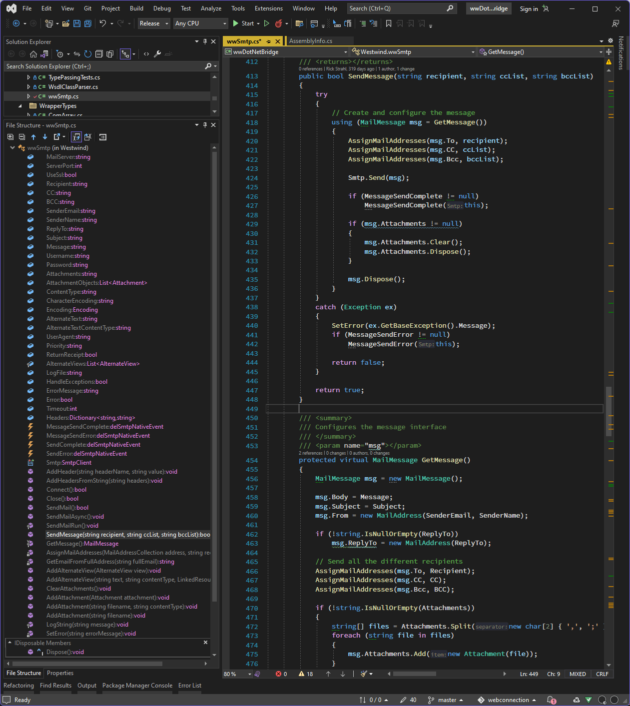

The FoxPro class on the other end then mirrors the .NET class and simply calls the corresponding methods. 

The `SendMail()` method in the FoxPro class gives an idea how this works:

```foxpro
************************************************************************
* wwSmtp ::  SendMail
****************************************
***  Function: Self contained method that sends a single
***            email message.
***    Assume:  Uses .NET / wwDotNetBridge.dll
***      Pass:  nothing - set properties/AddAttachment/AddALternateView
***    Return: .T. of .F. check cErrorMsg on .F. result
************************************************************************
FUNCTION SendMail
LOCAL lcSubject, llResult

this.CreatewwSmtp()  && ensure instance is loaded
this.SetError()

lcSubject=TRIM(THIS.cSubject)	
lcSubject = CHRTRAN(lcSubject,CHR(13)+CHR(10)," ") && Strip out CRLF

LOCAL loSMTP as Westwind.wwSmtp
loSmtp = this.oSmtp  && .NET COM Instance

loSmtp.MailServer = TRIM(THIS.cMailServer)
loSmtp.ServerPort = this.nServerPort
loSmtp.UseSsl = this.lUseSsl
loSmtp.Timeout = this.nTimeout

loSmtp.Username = TRIM(this.cUsername)
loSmtp.Password = TRIM(this.cPassword)

loSmtp.Subject = lcSubject
loSmtp.Message = TRIM(THIS.cMessage)
loSmtp.ContentType = TRIM(THIS.cContentType)
loSmtp.AlternateText = (this.cAlternateText)
loSmtp.AlternateTextContentType = this.cAlternateContentType

loSmtp.SenderEmail = this.cSenderEmail
loSmtp.SenderName = this.cSenderName

loSmtp.Attachments = this.cAttachment
loSmtp.UserAgent = this.cUserAgent

*** Message options
loSmtp.ReturnReceipt = this.lReturnReceipt
loSmtp.ReplyTo = this.cReplyTo
loSmtp.Priority = this.cPriority

*** Add explicit headers
loSmtp.AddHeadersFromString(this.cExtraHeaders)

loSmtp.Recipient = this.cRecipient
loSmtp.CC = this.cCCList
loSmtp.BCC = this.cBccList

IF this.lAsync
	loSmtp.SendMailAsync()
	llResult = .T.
ELSE	
	llResult = loSmtp.SendMail()
	IF !llResult
		this.SetError(loSmtp.ErrorMessage)
	ENDIF
ENDIF

*** Must clear out headers
this.cExtraHeaders = ""

RETURN llResult
*  wwSmtp ::  SendMail
```

The `THIS.oSmtp` object is the wwSmtp  .NET instance of the `wwSmtp` .NET class that's used to send the email. This the self contained function that does the operation - there are other methods that open a connection and send individual messages for multiple recipients on the same connection. But as you can see the complexity of the .NET functionality has been whittled down to something that's quite easy to use, while still giving access to the underlying functionality if absolutely required because you have access to the `THIS.oSmtp` instance.

Since in this case I'm dealing with an object instance there need to be methods that create the instance and then also clean up that instance when the class is destroyed which is important to ensure you don't leave hanging references around causing a memory leak:

```foxpro
FUNCTION CreatewwSmtp(lcDotnetVersion)

IF ISNULL(this.oBridge)
	this.oBridge = GetwwDotnetBridge(lcDotnetVersion)
ENDIF

IF ISNULL(this.oSmtp)
	this.oSmtp = this.oBridge.CreateInstance("Westwind.wwSmtp")
	IF ISNULL(this.oSmtp)
	   *** Throw an error with the actual error message
	   ERROR this.oBridge.cErrorMsg
	ENDIF
ENDIF
ENDFUNC
*  wwSmtp ::  CreatewwSmtp

FUNCTION Dispose()

IF !ISNULL(this.oSmtp)
	this.oSmtp.Dispose()
ENDIF	
this.oSmtp = null
this.oBridge = null

ENDFUNC
*  wwSmtp ::  Dispose

************************************************************************
* wwSmtp ::  Destroy
****************************************
FUNCTION Destroy()
this.Dispose()
ENDFUNC
*  wwSmtp ::  Destroy
```

In my own applications, and in work I've done for customers, this particular scenario is quite a common one, where I basically abstract a complex set of operations into something that is specifically tailored for the calling application. Here's it's a component but a few other scenarios for me:

* **Wrapper around a Credit Card Processing Providers**  
Created a wrapper interface that works with BrainTree, Authorize.NET, Stripe and several small providers using a unified interface to process credit cards for all of them. The .NET class provides the core abstraction with a fairly flat interface that consolidates the various libraries into a single class with only the required fields that need to be sent for the specific application. 

* **A .NET Type Parsing Library in Html Help Builder**   
I needed to integrate .NET type parsing into Help Builder so that I could import .NET types and document them. The .NET code uses very complex Reflection code, parsing of HTML Doc files to parse entire .NET assemblies into documentation that can then be exported to a Web site as part of a larger Documentation project. The class exposes a hierarchy of objects that easily accessible over COM from FoxPro and FoxPro uses these objects directly to display the type information in tree format for the importer that parses the classes into the Help Builder documentation classes.

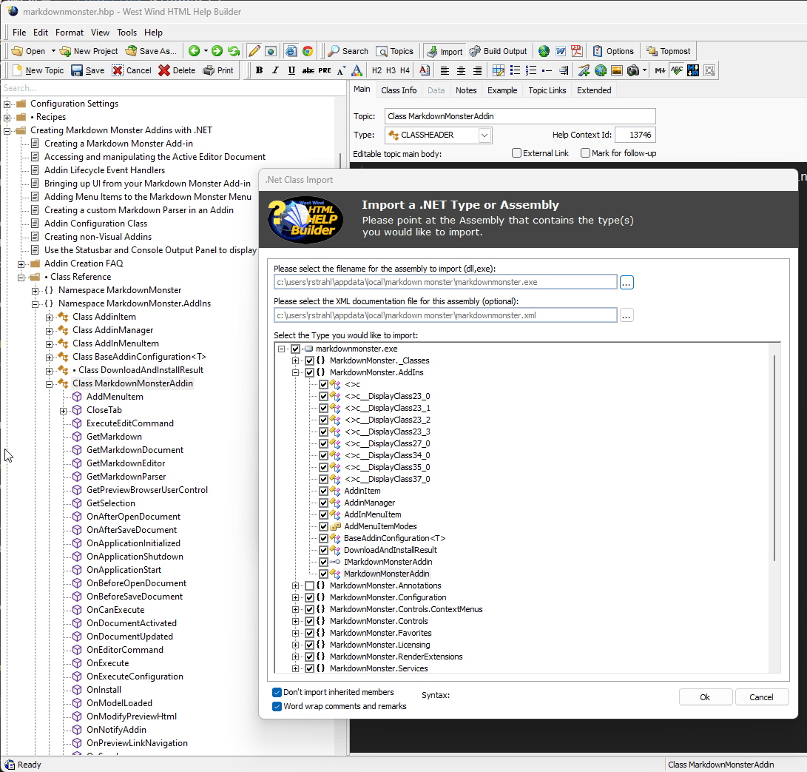

* **SOAP Web Service Wrappers**  
SOAP Web Services can be imported in .NET via Windows Communication Foundation (WCF), and you can then create wrapper methods to instantiate the service classes and call them from FoxPro. In this scenario the FoxPro app mostly works directly with the exported COM types, but the custom .NET class wrapper provides the WCF service instantiation and initial connection which uses several difficult to access objects.

All of these examples (and many more) involve creating a .NET component that exposes base functionality that is then accessed by FoxPro. The wrapper simplifies the .NET libraries or interfaces and exposes only a relevant subset with much of the heavy processing handled in .NET and FoxPro only picking up the final results.

## Summary
Phew - a lot covered in this article!

.NET provides a great way to extend the functionality of FoxPro beyond FoxPro's base features. These days .NET provides the most common extensibility framework for Windows components from Microsoft, as well as many third party integration and tools. The main reason .NET is well suited to this is because it's relatively easy to integrate with from FoxPro through it's COM capabilities. With the features of wwDotnetBridge you can access most .NET features relatively easily from FoxPro.

The goal of this paper has been to give you an introduction to integrating .NET into FoxPro with focus of creating custom .NET components that provide an interface layer for your FoxPro code to simplify interacting with .NET code from FoxPro. We've seen several ways that you can accomplish that:

* Using plain COM Interop from FoxPro
* Using wwDotnetBridge from FoxPro
* Creating custom .NET Components and interact with those using wwDotnetBridge

I hope this paper has given you a good idea of what's involved in doing that using both the new low impact SDK tooling that allow you compile .NET from the terminal without any special tooling, or by using a traditional IDE like Visual Studio or Rider to create your .NET components. We've seen how to build components in a FoxPro friendly way to help ease the COM interface that's used for communication between FoxPro and .NET.

I know this type of integration has completely changed how I build many FoxPro application, with the ability to offload more and more functionality to .NET. I hope this session and paper give you some inspiration to integrate some of your own components using .NET as well.
  
Onwards and upwards.


## Resources
* [.NET SDK Downloads (for development)](https://dotnet.microsoft.com/en-us/download/dotnet/6.0)
* [.NET Runtime Downloads (32 bit Desktop Runtime)](https://dotnet.microsoft.com/en-us/download/dotnet/6.0)
* [LinqPad](https://www.linqpad.net/) for Testing .NET Code (command window)
* .NET Decompilers (discover classes/members/names)
    * .NET Reflector (old version (v6) is free)
    * [JetBrains DotPeek (free)](https://www.jetbrains.com/decompiler/) 
    * [Telerik JustDecompile (free)](https://www.telerik.com/products/decompiler.aspx)
    