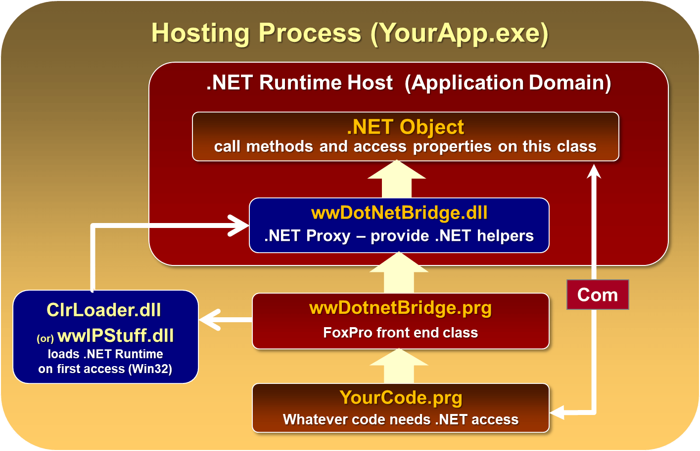
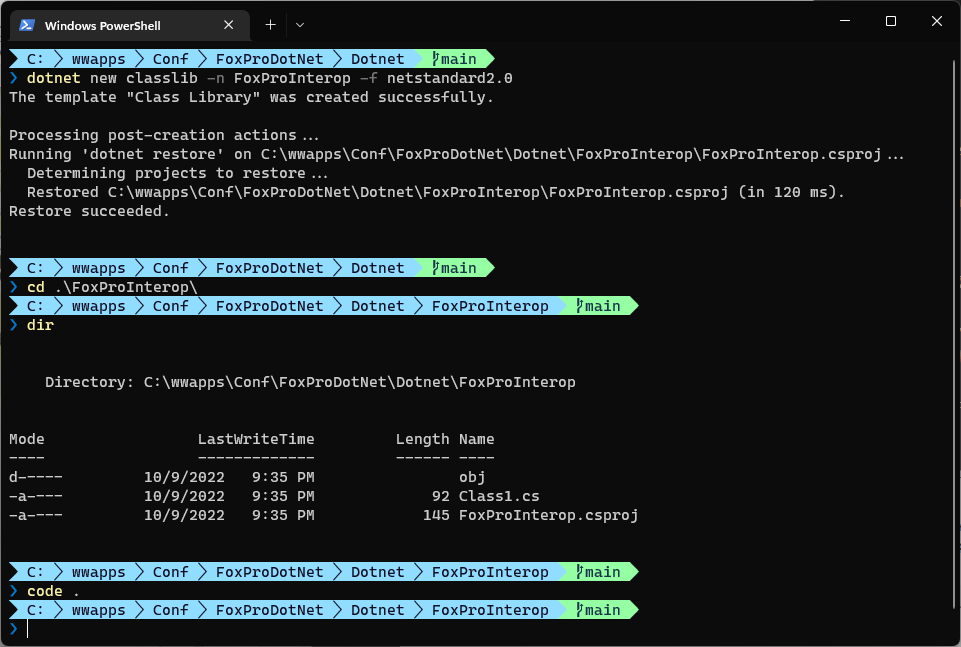

# Using .NET with wwDotnetBridge in FoxPro

<div style="margin: 1em 0 3em 0; font-size: 0.8em;">

*by **Rick Strahl***  
*prepared for **Virtual FoxFest**, 2022*  
*[Session Example Code](https://github.com/RickStrahl/VirtualFoxFest2022-FoxProDotnet) on GitHub*

</div>


If you're building modern applications that need to interface with various system or operating system features, you'll likely need external functionality that isn't available natively in FoxPro. Whatever your needs are, you can probably find this functionality in .NET either via built-in .NET system features, or by way of open source or third party libraries. For Windows applications .NET is easily the most comprehensive integration solution as it provides an interop layer to integrate directly from FoxPro.

As FoxPro developers we can take advantage of .NET by using .NET as a proxy to access .NET features or libraries. We can call into .NET code from FoxPro either via out-of-box COM Interop features, or with the [open source wwDotnetBridge Interop library](https://github.com/RickStrahl/wwDotnetBridge). The latter gives you many more features and more control over how you interact with .NET.

While both COM Interop and wwDotnetBridge can directly call .NET code, if your code requires complex logic that has to be accessed in .NET, you'll find that these approaches often are cumbersome as FoxPro's support for many .NET features is limited. wwDotnetBridge gives access to most advanced .NET concepts, but even so it's often much more verbose than native .NET code.

For this reason it's often much easier to create a small .NET component to perform the actual .NET code integration, and then expose the created component to FoxPro. This results in cleaner code, better performance and on the FoxPro side a clean interface that is custom tailored to the integration's needs.
 
Yes, this approach involves writing .NET code - C# most likely - and creating a small project, adding .NET classes, building and compiling into a .NET assembly (a DLL) which you can then call from FoxPro. If you've never used .NET before this can be intimidating, but the reality is that this component integration approach is actually one of the easiest ways to ease into getting started with .NET, as you deal with a small very business specific piece of code. Building library level code lets you skip over some of the high level decisions like what UI framework to use and how to build your UI, but instead focus on pure business logic. 

> In short, building integration compponents us a great way to get your feet wet with .NET and think about how you can use it to extend your applications beyond just FoxPro code.


The timing of this session is also well timed IMHO: These days it's a **lot easier to create a .NET project** without having to install a massive Visual Studio and other support tools. These days you can install a single .NET SDK and use the Command Line or generic editor tools to create a .NET project, build and compile it. The process and resources involved are a lot simpler than it used to be in the past. Visual Studio still is easier, but it's no longer a requirement - in fact you can everything you need to build from the command line these days.

In this session I want to show you get started with using .NET via wwDotnetBridge, initially to call some .NET components, and then show how you can create your own .NET components with minimal effort and use them from FoxPro. In the process I'll explain the key concepts on how this process works and for things that you need to watch out for in the Interop process.

So strap in, and let's get started...

## Integrating with .NET: A few options
As mentioned there are two main mechanisms you can use to do Interop between FoxPro and .NET:

* **.NET COM Interop**  
.NET supports a native COM interface wrapper that allows **.NET components to be exposed as COM objects**. Unfortunately the native support is **very limited** and requires explicitly registered and marked components which means either you have to use your own components or the handful of .NET components that explicitly support COM Interop. COM by itself is also limited in .NET type features it can access, due to limitations in the COM type system compared to .NET's rich type system . For example, you can't call static members, you can't easily access collections and dictionaries, and even many simple types like Guids, Decimals or Longs can't be accessed directly.

* **wwDotnetBridge**  
wwDotnetBridge is an Open Source FoxPro library that provides a proxy interface into .NET. It also uses COM Interop, but works around many limitations of COM Interop by providing Proxy functionality inside of .NET that allows accessing features that native COM interaction cannot access directly. It requires no explicitly registration for components, can access most .NET types directly, and supports common features like access to static members, collections and dictionaries and many other problem types not supported via pure COM.

> Of these two using wwDotnetBridge is almost always the better choice, as it removes the COM registration and COM marked requirement of stock COM Interop. That feature alone is enough to use wwDotnetBridge in my view - once you get the .NET object reference behavior is initially identical to COM Interop. But beyond that wwDotnetBridge then provides proxy functionality to work around COM Interop limitations. Personally I **never** use .NET COM Interop from FoxPro - there's no benefit in its use and no downside for using wwDotnetBridge except for the two DLL distribution requirement.


## Integration Schemes
While both these mechanisms allow you to access .NET components from FoxPro, the process of doing so from FoxPro is not always easy. You need to know what the interface for components looks like so you can instantiate the right types and call the appropriate members, and you often need to use more verbose indirect access syntax to access .NET features that COM doesn't expose. 

So you really have two choices on how to work with .NET:

* Do Interop from FoxPro in .NET with FoxPro code and Proxying
* Create a .NET Component wrapper and call it from FoxPro

The latter approach is the larger focus of this session. Rather than writing a lot of .NET interop code with COM interop or wwDotnetBridge, you can create a small .NET component, and write .NET code to interact with the required functionality, then return results back to FoxPro. 

The .NET component can act as a proxy to provide a FoxPro friendly interface that performs better and is simpler to code against from FoxPro as you can explicitly create types that are directly accessible from FoxPro.

## Calling .NET Components from FoxPro with wwDotnetBridge
This is a quick introduction to wwDotnetBridge and its basic functionality. 




## Creating a Dotnet Component
Using the new .NET SDK tools you can now create .NET components without requiring a big development environment. You can use the command line tools - or a light weight editor like Visual Studio Code - that supports the generic OmniSharp .NET Build tools to build .NET components or applications.

However, if you are already doing .NET development, there are still some advantages to using Visual Studio, chief among them the ability to debug your .NET code interactively when called from your FoxPro code. 

But for the core build functionality you can easily use the command line tools or Omnisharp to build your application.


### What you need to build a .NET Classlibrary
In order to create a .NET component you need to [install the latest .NET SDK](https://dotnet.microsoft.com/en-us/download/visual-studio-sdks) (download the latest **LTS Release**), which includes all the required tools to build, run and debug .NET applications. The SDK also installs the .NET Core runtime along with the ASP.NET and Windows runtimes. Although you don't need that it's there if you choose later to build a full .NET application. 

The base **.NET Core Runtime** which we are interested in for building FoxPro integration components includes:

* Class libraries
* Console applications

Distributed applications then require the .NET Core runtime that is of the same major version (ie. 6.0). The current version of the .NET Core runtime as I write this is `6.0.9`. The minor versions update quite frequently but these runtimes are forwards and backwards compatible to the same major version so as long as a v6.0 runtime is installed it works.

### Creating a new .NET Project from the Command Line
With the SDK installed you can now create a new .NET Project. Out of the box, the latest .NET Tools do not support `.NET 4.x` projects, but you can still use the tools to create a project.

* Create a folder for your project
* Run `dotnet new classlib <projectName>` (or leave out the name and the folder name is used)
* Change the project's to `<TargetFramework>net472</TargetFramework>`
* Adjust project for C# 7 syntax (.NET Framework only supports up to C# 7)

So create your project in a folder of your choice. I'm going to use a project named `FoxProInterop` based on the following sample folder structure:

```
FoxProDotnet
   -  FoxPro     (FoxPro samples)
      - Bin      (place compiled .NET binaries here)
   -  Dotnet
   -  FoxProInterop  (Project Files in here)
```

So first start by changing to the folder where you want to create your project under. The create project process creates a new project under the folder you choose with the `-n` name that you specify.

```ps
# go to folder where you want to create the project (project create below)
cd Dotnet

# Create the project
dotnet new classlib -n FoxProInterop

# Change to the created project folder
cd FoxProInterop

# Start up the editor (or open FoxProInterop.csproj)
code .
```

Here's what that looks like when you run it in Powershell:



### Fixing up the Project for .NET 4.72
Next we need to make some changes to the generated project. The project creates a class library which is just a single class file. Using the new SDK project style in .NET code files and many others that are 'processed' as part of a project, don't have to be explicit added to a project, so you can just create a new file and it will be automatically *included in the project* and compiled as part of the library.

In fact the generated project file is extremely simple:

```xml
<Project Sdk="Microsoft.NET.Sdk">

  <PropertyGroup>
    <TargetFramework>net6.0</TargetFramework>
    <ImplicitUsings>enable</ImplicitUsings>
    <Nullable>enable</Nullable>
  </PropertyGroup>

</Project>
```

Notice that the project was created for .NET 6.0 - not .NET 4.72 or 4.8 as we would like to. However, that is supported, but unfortunately not through the command line options. To fix this we need to make a change - a simplification really - of the project file:

```xml
<Project Sdk="Microsoft.NET.Sdk">

  <PropertyGroup>
    <TargetFramework>net472</TargetFramework>
  </PropertyGroup>

</Project>
```

The `<TargetFramework>` specified the framework that the project compiles to - I want it to compile `net472` which is the framework moniker for .NET Framework 4.72. For 4.8 it's `net48`. .NET Core versions are typically `net6.0` (current) or `net5.0` or `net7.0`.

Why does that matter?

### Classic .NET Framework vs .NET Core

#### .NET Framework
The original, Windows only version of .NET that is now part of the Windows platform is the classic .NET Framework. It ships and is updated with Windows, so it's pre-installed on practically any Windows machine post Vista with version 4.5 or later installed on Windows 8.1 and later. The big advantage of this framework is that it's already installed - no extra installation it require and it just works. The .NET Framework is very rich and includes the vast majority of features that are available to .NET today, but this framework is officially done - meaning Microsoft is no longer adding new features to it. What you see is what you get basically. 

This sounds bad, but for many years, most new improvements and features have come in the form of libraries and extensions that extend the framework rather than in the core framework. 

* Pre-installed and updated as part of Windows OS
* Includes all Windows features out-of-box
* Tightly integrated with the OS
* Doesn't require any runtimes
* Versions are synchronized to Windows and fully interopable
* Version 4.8 is the last version 
* No longer updated with new features (only patches and security fixes)

#### .NET Core
Microsoft's latest incarnation of .NET is .NET Core which is a completely re-built version of .NET that is:

* Cross Platform (Windows, Mac, Linux)
* High Performance 
* Light weight (smaller footprint and memory usage)
* Optimized for heavy server workloads
* Actively developed
* Requires one or more Runtimes to be installed
* Versions 

#### Choices, Choices
The future *for Microsoft and .NET* is clearly in .NET Core, not .NET Framework. If you're building full .NET server applications there is no reason to build them in classic .NET any longer due to the new service frameworks and massive performance gains in Core. For desktop applications the situation is more varied - you get new language and framework features, all of the performance features but at the downside of having to deal with managing runtime distribution for the .NET Core runtimes and keeping versions up to date.

*For FoxPro the situation is different though, because as an external application calling into .NET you want the process to be as transparent as possible for the host FoxPro application. Installing an explicit runtime can be a big detriment and often may outweigh the benefit the integration provides.

For this reason I would still recommend that we continue to use the classic .NET Framework (`net472` or `net48`) for targeting any components you create for use with Visual FoxPro rather than .NET Core.

If you create your own components there's little reason to use .NET Core - you're not going to see any great performance gains or advantages for new language features in typical library integrations. Instead prefer the universal availability of .NET and not having to worry about installation of a huge runtime or even determining of whether it need to be installed in the first place.

The only reason you should consider using .NET Core from FoxPro is that you need to call a library that is only available for .NET Core. This should be relatively rare today, as most libraries these days either multi-target both .NET Framework and .NET Core or use `.NET Standard` which can be used from classic .NET.

Note that you can use either version using **wwDotnetBridge** - wwDotnetBridge recently added support for creating and accessing .NET Core components, although that too is a bit more complicated as the right runtime has to be located.

Bottom line: If at all possible use full .NET Framework with your .NET Integrations, unless you have to explicitly call a .NET Core only supported library.

### Changing the Generated Class
So when the `dotnet new classlib` command created your project, you unfortunately can't target the `net472` target framework - it's not supported. While there's a `-f` target framework switch, classic .NET projects are not supported. If you don't specify a version the latest active version - `net6.0` in this case - is used. 

We already changed the `<TargetFramework>net472</TargetFramework>` but we also need to fix the generated class, because it uses that latest C# syntax that is not supported in the older full framework versions.

The original C# class generated looks like this:

```cs
namespace FoxProInterop;
public class Class1
{

}
```

This code uses C# 10 implicit namespaces which removes an indentation level. This is not supported in C# 7.3 which is the latest version that full framework supports.

I'm going to add an explicit namespace and rename the class to `Interop`  while I'm at it:

```cs
namespace FoxProInterop
{
    public class Interop
    {        

    }
}
```

I'll also rename the file from `Class1.cs` to `Interop.cs`.

Next I'll add a `HelloWorld` method to the class:

```cs
using System;

namespace FoxProInterop
{
    public class Interop
    {        

        public string HelloWorld(string name) {
            return "Hello World, " + name + 
                   ". Time is: " + DateTime.Now.ToString("HH:mm:ss");
        }
        
    }
}
```


  
## Resources

* .NET Decompilers (discover classes/members/names)
    * .NET Reflector (old version (v6) is free)
    * [JetBrains DotPeek (free)](https://www.jetbrains.com/decompiler/) 
    * [Telerik JustDecompile (free)](https://www.telerik.com/products/decompiler.aspx)
    